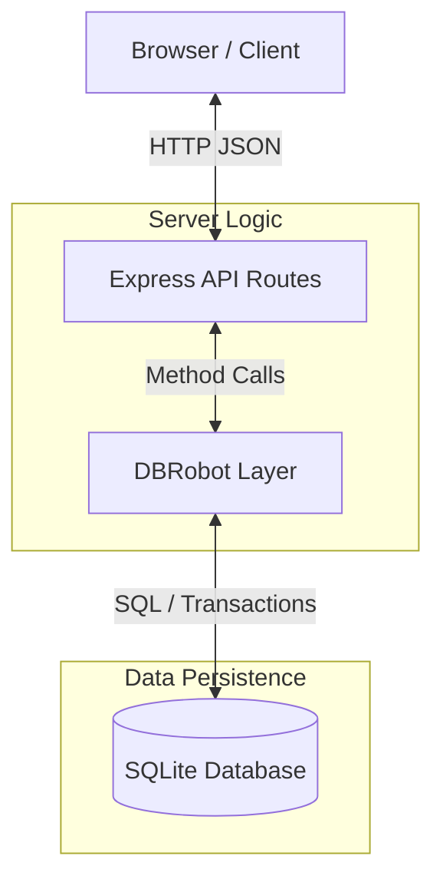

# Coolkonyha Solo Vibe - Solution Design

## Project Overview
Coolkonyha Solo Vibe is a specialized order and product management system designed for efficient kitchen operations. It handles customers, suppliers, products, and orders with a focus on business rule enforcement and verifiable audit trails.

**Last updated:** 2026-06-18
**Current Version:** [v0.8.0](./docs/.versions/v0.8.0.md)

## Technology Stack
- **Frontend:** React + Vite
- **Backend:** Express.js + Node.js
- **Database:** SQLite with business rule logic layer
- **AI:** Google Gemini API (`@google/generative-ai`)
- **Languages:** JavaScript (ES modules)
- **Styling:** CSS / Tailwind

## Architecture Overview



- **Browser:** React frontend consuming the API.
- **Express:** Handles HTTP routing, CORS, and request parsing.
- **P.I.S.T.A. (Proactive Intelligent System for Task Automation):** AI Agent that interprets emails & chat, learns sender preferences, and communicates with CK. No direct DB writes.
- **DBRobot:** Deterministic data access Robot that encapsulates all business rules (Dual-Write, Pricing Continuity). No AI.
- **SQLite:** Relational storage with foreign key enforcement.

## Assistant Team: Agents and Robots

The system is built around a clear separation between **AI Agents** (things that reason) and **Robots** (things that execute deterministically). There is currently **one Agent** and **two Robots**.

```
Gmail Robot              CK's Chat Input
     │                         │
     └──────────┬──────────────┘
                ▼
        🧠 P.I.S.T.A.            ← ONE agent, does both:
         ├─ interprets new info (email / chat note)
         ├─ learns sender preferences from CK
         ├─ reads DB context when needed
         ├─ updates DB via DBRobot
         └─ communicates back to CK
                │
                ▼
           DBRobot (existing)
         ├── processed_emails
         ├── order_status_history
         ├── orders
         └── sender_rules
```

| Actor | Type | Role | Detail Doc |
|---|---|---|---|
| P.I.S.T.A. | 🧠 Agent (AI) | Interprets emails & chat, learns sender preferences, proposes actions to CK | [pista-agent.md](./docs/assistant_team/pista-agent.md) |
| Email Robot | 🤖 Robot | Fetches emails from Gmail (INBOX + SENT), deduplicates and filters via `sender_rules` | [email-robot.md](./docs/assistant_team/email-robot.md) |
| DBRobot | 🤖 Robot | Executes all DB writes, enforces business rules (Dual-Write, Pricing Continuity) | [database-robot.md](./docs/assistant_team/database-robot.md) |

## Documentation Index

### Architecture Documentation

- [Database Robot](./docs/assistant_team/database-robot.md) - Data access robot & business rules
- [API Routes](./docs/architecture/api-routes.md) - REST endpoints overview
- [Database Schema](./docs/architecture/database-schema.md) - Schema definitions & ER diagram
- [Database Connection](./docs/architecture/database-connection.md) - Singleton connection management
- [P.I.S.T.A. Agent](./docs/assistant_team/pista-agent.md) - AI Agent definition & logic
- [Email Robot](./docs/assistant_team/email-robot.md) - Email fetching robot definition
- [UI Architecture](./docs/architecture/ui-data-flow.md) - Separation of concerns & data binding
- [Settings View](./docs/architecture/settings-view.md) - Settings view components & controller (v0.7.1)

### Business Logic Documentation

- [DB Robot Logic Tools](./docs/assistant_team/db_robot_logic_tools.md) - Detailed business rules
- [DB Robot Code Structure](./docs/assistant_team/db_robot_code_structure.md) - Code organization details

### Testing Documentation

- [Tests Overview](./docs/tests/README.md) - Test agent, structure, and scopes

### Other Documentation

- [App Description](./docs/app-description.md) - Product vision and wireframes
- [Notes](./docs/notes.md) - Scratch notes and open questions
- [Building History](./docs/building-docs/README.md) - Feature implementation history
- [Release Notes (v0.6.0)](./docs/.versions/v0.6.0.md) - Release information for v0.6.0
- [Release Notes (v0.7.0)](./docs/.versions/v0.7.0.md) - Release information for v0.7.0
- [Release Notes (v0.7.1)](./docs/.versions/v0.7.1.md) - Release information for v0.7.1
- [Release Notes (v0.8.0)](./docs/.versions/v0.8.0.md) - Release information for v0.8.0
- [UI Descriptions](./docs/designs/ui_descriptions.md) - Detailed UI component descriptions

## Component Responsibility Matrix

| Component | Location | Purpose | Documentation |
|-----------|----------|---------|---------------|
| P.I.S.T.A. | `server/pista.js` | AI reasoning, Senior PM workflow monitoring, CK communication | [pista-agent.md](./docs/assistant_team/pista-agent.md) |
| Email Robot | *(to be built)* | Gmail fetcher, deduplication | [email-robot.md](./docs/assistant_team/email-robot.md) |
| DBRobot | `server/agent.js` | Data access, business rules | [database-robot.md](./docs/assistant_team/database-robot.md) |
| Routes | `server/routes.js` | REST API endpoints | [api-routes.md](./docs/architecture/api-routes.md) |
| DB Connection | `server/db.js` | SQLite connection | [database-connection.md](./docs/architecture/database-connection.md) |
| Data Service | `ui_design/js/services/dataService.js` | Centralized UI data provider | [ui-data-flow.md](./docs/architecture/ui-data-flow.md) |
| Main UI | `index.html` | Dashboard entry point (Oceanic Plus design) | [ui_descriptions.md](./docs/designs/ui_descriptions.md) |
| Database UI | `ui_design/views/database.html` | Database viewer interface containing data tables and edit modals | [ui_descriptions.md](./docs/designs/ui_descriptions.md) |
| Database Controller | `ui_design/js/controllers/databaseController.js` | Controller handling Database view state, search, and dynamic modals | [ui_descriptions.md](./docs/designs/ui_descriptions.md) |
| Maintenance UI | `ui_design/views/maintenance.html` | Isolated maintenance tracking view | [ui_descriptions.md](./docs/designs/ui_descriptions.md) |
| Settings UI | `ui_design/views/settings.html` | Settings page (General + Admin sections) | [settings-view.md](./docs/architecture/settings-view.md) |
| Settings Controller | `ui_design/js/controllers/settingsController.js` | Tab logic, theme sync, version display, toast | [settings-view.md](./docs/architecture/settings-view.md) |
| Server | `server/index.js` | Express app entry | - |

## Quick Reference

### Code → Documentation Map

- `server/agent.js` → `docs/assistant_team/database-robot.md`
- `server/routes.js` → `docs/architecture/api-routes.md`
- `server/db.js` → `docs/architecture/database-connection.md`
- Database tables → `docs/architecture/database-schema.md`
- Business rules → `docs/assistant_team/db_robot_logic_tools.md`
- `server/pista.js` → `docs/assistant_team/pista-agent.md`
- `ui_design/js/services/dataService.js` → `docs/architecture/ui-data-flow.md`

### Documentation → Code Map

- Dual-write pattern → `server/agent.js:updateOrderStatus()`
- Pricing continuity → `server/agent.js:addOrderItem()`
- Foreign keys → `server/db.js:constructor()`

## How to Maintain This Documentation

### When Code Changes

1. Update corresponding documentation file in `docs/architecture/`
2. Update code cross-references if method names change
3. Update this index if new components are added

### When Architecture Changes

1. Create new architecture documentation file following the 4-part structure
2. Add to this index under the appropriate category
3. Add cross-references in related code files

### Documentation Review Checklist

- [ ] All components listed in Component Responsibility Matrix
- [ ] All architecture docs follow 4-part structure
- [ ] Bidirectional links working (code ↔ docs)
- [ ] Mermaid diagrams render correctly
- [ ] Security considerations documented
