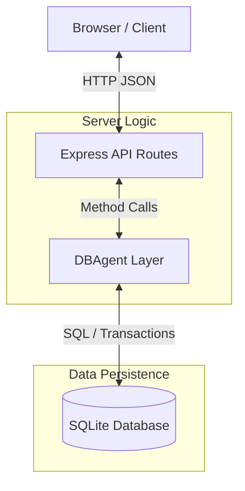

# Coolkonyha Solo Vibe - Solution Design

## Project Overview
Coolkonyha Solo Vibe is a specialized order and product management system designed for efficient kitchen operations. It handles customers, suppliers, products, and orders with a focus on business rule enforcement and verifiable audit trails.

## Technology Stack
- **Frontend:** React + Vite
- **Backend:** Express.js + Node.js
- **Database:** SQLite with business rule logic layer
- **Languages:** JavaScript (ES modules)
- **Styling:** CSS / Tailwind

## Architecture Overview

- **Browser:** React frontend consuming the API.
- **Express:** Handles HTTP routing, CORS, and request parsing.
- **DBAgent:** Centralized access layer that encapsulates all business rules (Dual-Write, Pricing Continuity).
- **SQLite:** Relational storage with foreign key enforcement.

## Documentation Index

### Architecture Documentation
- [Database Agent](file:///d:/dev/coolkonyha-solo-vibe/docs/architecture/database-agent.md) - Data access layer & business rules
- [API Routes](file:///d:/dev/coolkonyha-solo-vibe/docs/architecture/api-routes.md) - REST endpoints overview
- [Database Schema](file:///d:/dev/coolkonyha-solo-vibe/docs/architecture/database-schema.md) - Schema definitions & ER diagram
- [Database Connection](file:///d:/dev/coolkonyha-solo-vibe/docs/architecture/database-connection.md) - Singleton connection management

### Business Logic Documentation
- [DB Agent Logic Tools](file:///d:/dev/coolkonyha-solo-vibe/docs/agent_logics/db_agent_logic_tools.md) - Detailed business rules
- [DB Agent Code Structure](file:///d:/dev/coolkonyha-solo-vibe/docs/agent_logics/db_agent_code_structure.md) - Code organization details

### Building History
- [Building Documentation Index](file:///d:/dev/coolkonyha-solo-vibe/docs/building-docs/README.md) - Feature implementation history

## Component Responsibility Matrix

| Component | Location | Purpose | Documentation |
|-----------|----------|---------|---------------|
| DBAgent | `server/agent.js` | Data access, business rules | [database-agent.md] |
| Routes | `server/routes.js` | REST API endpoints | [api-routes.md] |
| DB Connection | `server/db.js` | SQLite connection | [database-connection.md] |
| Server | `server/index.js` | Express app entry | - |

## Quick Reference

### Code → Documentation Map
- `server/agent.js` → `docs/architecture/database-agent.md`
- `server/routes.js` → `docs/architecture/api-routes.md`
- `server/db.js` → `docs/architecture/database-connection.md`
- Database tables → `docs/architecture/database-schema.md`
- Business rules → `docs/agent_logics/db_agent_logic_tools.md`

### Documentation → Code Map
- Dual-write pattern → `server/agent.js:updateOrderStatus()`
- Pricing continuity → `server/agent.js:addOrderItem()`
- Foreign keys → `server/db.js:constructor()`

## How to Maintain This Documentation

### When Code Changes
1. Update corresponding documentation file in `docs/architecture/`
2. Update code cross-references if method names change
3. Update this index if new components are added

### When Architecture Changes
1. Create new architecture documentation file following the 4-part structure
2. Add to this index under the appropriate category
3. Add cross-references in related code files

### Documentation Review Checklist
- [ ] All components listed in Component Responsibility Matrix
- [ ] All architecture docs follow 4-part structure
- [ ] Bidirectional links working (code ↔ docs)
- [ ] Mermaid diagrams render correctly
- [ ] Security considerations documented
