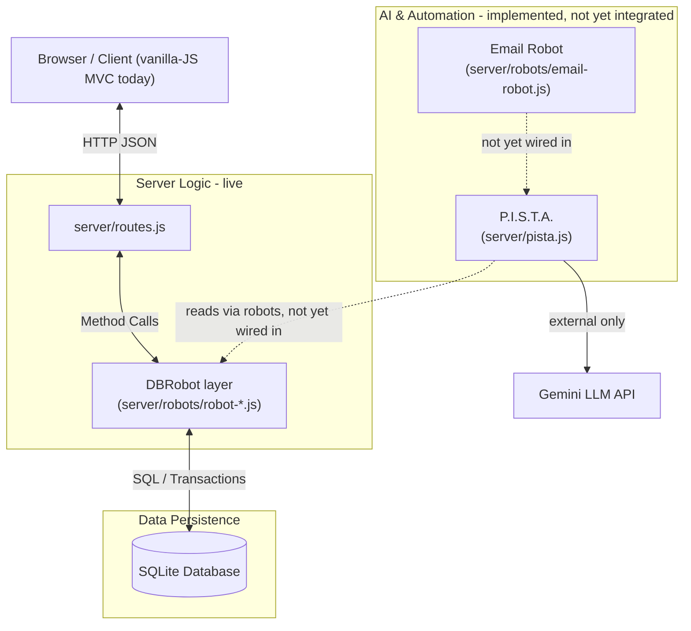

# Coolkonyha Solo Vibe - Solution Design

## Project Overview
Coolkonyha Solo Vibe is a local-first order/CRM/business-manager app for CK, a solo operator selling ice-cube-maker products. It reads Gmail, interprets order-related emails, tracks orders and maintenance cases through defined business-status workflows, keeps an immutable audit trail, and requires CK's explicit approval before any consequential action.

**Last updated:** 2026-09-03
**Current Version:** 0.9.0 — in progress (module map + frontend-scoping work landed under this version; not yet released). Last released: [v0.8.0](./docs/.versions/v0.8.0.md).

## Technology Stack
- **Frontend (target):** React + Vite — dependencies are installed (`react`, `react-dom`, `vite` in `package.json`) but **the UI actually served today has not migrated yet.** It's a template-based vanilla-JS MVC (`index.html` + `ui_design/js/services/dataService.js` + HTML `<template>` + router-driven controllers). Migrating it to React is an open, owner-approval-pending decision — see `docs/.impl_plans/0.9.0_20260903-082033_frontend-scope-*.md`.
- **Backend:** Express.js + Node.js
- **Database:** SQLite with business rule logic layer
- **AI:** Google Gemini API (`@google/generative-ai`)
- **Languages:** JavaScript (ES modules)
- **Styling:** CSS / Tailwind

## Architecture Overview



- **Browser:** consumes the REST API; currently the vanilla-JS template MVC, not yet React (see Technology Stack note above).
- **Express (`server/routes.js`):** Handles HTTP routing, CORS, and request parsing; delegates to the domain robots.
- **P.I.S.T.A. (Proactive Intelligent System for Task Automation):** AI Agent that interprets emails & chat, learns sender preferences, and communicates with CK. No direct DB writes. **Implemented** (`server/pista.js`) but **not wired into the live server** — no route or scheduler instantiates it yet.
- **DBRobot layer:** Deterministic data access, encapsulating all business rules (Dual-Write, Pricing Continuity). No AI. Implemented as five domain-scoped files under `server/robots/` (see Component Responsibility Matrix). The pre-split monolith this superseded was confirmed dead code and retired to `.trash/server/agent.js` on 2026-09-03.
- **SQLite:** Relational storage with foreign key enforcement.

> For the authoritative, per-file current state of the backend, see the [Module Map](./docs/architecture/module-map/index.md) — it is regenerated by hand alongside every code change and is more current than the narrative docs linked below.

## Assistant Team: Agents and Robots

The system is built around a clear separation between **AI Agents** (things that reason) and **Robots** (things that execute deterministically). There is **one Agent** and **two Robots** (the second Robot, DBRobot, is physically split into five domain files).

```
Gmail Robot              CK's Chat Input
     │                         │
     └──────────┬──────────────┘
                ▼
        🧠 P.I.S.T.A.            ← ONE agent, does both:
         ├─ interprets new info (email / chat note)
         ├─ learns sender preferences from CK
         ├─ reads DB context when needed
         ├─ updates DB via DBRobot
         └─ communicates back to CK
                │
                ▼
           DBRobot (server/robots/robot-*.js)
         ├── processed_emails
         ├── order_status_history
         ├── orders
         └── sender_rules
```

**Implementation status:** Email Robot and P.I.S.T.A. are both fully coded but **not yet wired into the running server** — nothing currently instantiates or schedules them. DBRobot is implemented and live, consumed by every route in `server/routes.js`.

| Actor | Type | Role | Status | Detail Doc |
|---|---|---|---|---|
| P.I.S.T.A. | 🧠 Agent (AI) | Interprets emails & chat, learns sender preferences, proposes actions to CK | Implemented, not wired in | [pista-agent.md](./docs/assistant_team/pista-agent.md) |
| Email Robot | 🤖 Robot | Fetches emails from Gmail (INBOX + SENT), deduplicates and filters via `sender_rules` | Implemented, not wired in | [email-robot.md](./docs/assistant_team/email-robot.md) |
| DBRobot | 🤖 Robot | Executes all DB writes, enforces business rules (Dual-Write, Pricing Continuity) | Implemented, live | [database-robot.md](./docs/assistant_team/database-robot.md) |

## Documentation Index

### Architecture Documentation

- [Module Map](./docs/architecture/module-map/index.md) - Living module map & dependency graph (primary navigation entry point)
- [Architecture Folder Index](./docs/architecture/README.md) - Contents list for `docs/architecture/`
- [Database Robot](./docs/assistant_team/database-robot.md) - Data access robot & business rules
- [API Routes](./docs/architecture/api-routes.md) - REST endpoints overview
- [Database Schema](./docs/architecture/database-schema.md) - Schema definitions & ER diagram
- [Database Connection](./docs/architecture/database-connection.md) - Singleton connection management
- [P.I.S.T.A. Agent](./docs/assistant_team/pista-agent.md) - AI Agent definition & logic
- [Email Robot](./docs/assistant_team/email-robot.md) - Email fetching robot definition
- [UI Architecture](./docs/architecture/ui-data-flow.md) - Separation of concerns & data binding
- [Settings View](./docs/architecture/settings-view.md) - Settings view components & controller (v0.7.1)

### Business Logic Documentation

- [DB Robot Logic Tools](./docs/assistant_team/db_robot_logic_tools.md) - Detailed business rules
- [DB Robot Code Structure](./docs/assistant_team/db_robot_code_structure.md) - Code organization details

### Testing Documentation

- [Tests Overview](./docs/tests/README.md) - Test agent, structure, and scopes

### Frontend Migration (pending decision)

- [Frontend Scope - Owner Summary](./docs/.impl_plans/0.9.0_20260903-082033_frontend-scope-owner.md) - Plain-language summary of the proposed React migration
- [Frontend Scope - Technical](./docs/.impl_plans/0.9.0_20260903-082033_frontend-scope-technical.md) - Technical scoping for migrating `index-db.html` to React
- [Design Spec (Oceanic)](./docs/designs/design-01-oceanic-spec.md) - Original design spec
- [Design Plan (Oceanic Plus)](./docs/designs/design-02-oceanic_plus-initplan.md) - Current UI design's init plan
- [UI Descriptions](./docs/designs/ui_descriptions.md) - Detailed UI component descriptions

### Project History & Working Notes

- [Implementation Plans](./docs/.impl_plans/) - Chronological log of implementation plans and session walkthroughs, one file per version-dated change
- [Working Notes](./docs/.notes/) - Scratch notes, open questions, and superseded drafts (informal, not authoritative)
- [Saved Prompts](./docs/.prompts/) - Reference prompts used during development
- [Building History](./docs/building-docs/README.md) - Feature implementation history
- [Release Notes (v0.5.0)](./docs/.versions/v0.5.0.md) - Release information for v0.5.0
- [Release Notes (v0.5.1)](./docs/.versions/v0.5.1.md) - Release information for v0.5.1
- [Release Notes (v0.5.2)](./docs/.versions/v0.5.2.md) - Release information for v0.5.2
- [Release Notes (v0.5.3)](./docs/.versions/v0.5.3.md) - Release information for v0.5.3
- [Release Notes (v0.6.0)](./docs/.versions/v0.6.0.md) - Release information for v0.6.0
- [Release Notes (v0.7.0)](./docs/.versions/v0.7.0.md) - Release information for v0.7.0
- [Release Notes (v0.7.1)](./docs/.versions/v0.7.1.md) - Release information for v0.7.1
- [Release Notes (v0.8.0)](./docs/.versions/v0.8.0.md) - Release information for v0.8.0
- [App Description](./docs/app-description-original.md) - Product vision and wireframes (superseded copy retained for reference; see repo history for what replaced it)

## Component Responsibility Matrix

| Component | Location | Purpose | Documentation |
|-----------|----------|---------|---------------|
| P.I.S.T.A. | `server/pista.js` | AI reasoning, Senior PM workflow monitoring, CK communication. Implemented, not wired into the live server. | [pista-agent.md](./docs/assistant_team/pista-agent.md) |
| Email Robot | `server/robots/email-robot.js` | Gmail fetcher, deduplication. Implemented, not wired into the live server. | [email-robot.md](./docs/assistant_team/email-robot.md) |
| DBRobot | `server/robots/robot-crm.js`, `robot-catalog.js`, `robot-orders.js`, `robot-maintenance.js`, `robot-pista-db.js` | Data access, business rules. Live, consumed by `routes.js`. (The superseded pre-split monolith was retired to `.trash/server/agent.js`.) | [database-robot.md](./docs/assistant_team/database-robot.md) |
| Routes | `server/routes.js` | REST API endpoints | [api-routes.md](./docs/architecture/api-routes.md) |
| DB Connection | `server/db.js` | SQLite connection | [database-connection.md](./docs/architecture/database-connection.md) |
| Data Service | `ui_design/js/services/dataService.js` | Centralized UI data provider | [ui-data-flow.md](./docs/architecture/ui-data-flow.md) |
| Main UI | `index.html` | Dashboard entry point (Oceanic Plus design) | [ui_descriptions.md](./docs/designs/ui_descriptions.md) |
| Database UI | `ui_design/views/database.html` | Database viewer interface containing data tables and edit modals | [ui_descriptions.md](./docs/designs/ui_descriptions.md) |
| Database Controller | `ui_design/js/controllers/databaseController.js` | Controller handling Database view state, search, and dynamic modals | [ui_descriptions.md](./docs/designs/ui_descriptions.md) |
| Maintenance UI | `ui_design/views/maintenance.html` | Isolated maintenance tracking view | [ui_descriptions.md](./docs/designs/ui_descriptions.md) |
| Settings UI | `ui_design/views/settings.html` | Settings page (General + Admin sections) | [settings-view.md](./docs/architecture/settings-view.md) |
| Settings Controller | `ui_design/js/controllers/settingsController.js` | Tab logic, theme sync, version display, toast | [settings-view.md](./docs/architecture/settings-view.md) |
| Server | `server/index.js` | Express app entry | - |

## Quick Reference

### Code → Documentation Map

- `server/robots/` (all files) → `docs/assistant_team/database-robot.md` (see also [module map](./docs/architecture/module-map/index.md) for per-file detail)
- `server/routes.js` → `docs/architecture/api-routes.md`
- `server/db.js` → `docs/architecture/database-connection.md`
- Database tables → `docs/architecture/database-schema.md`
- Business rules → `docs/assistant_team/db_robot_logic_tools.md`
- `server/pista.js` → `docs/assistant_team/pista-agent.md`
- `server/robots/email-robot.js` → `docs/assistant_team/email-robot.md`
- `ui_design/js/services/dataService.js` → `docs/architecture/ui-data-flow.md`

### Documentation → Code Map

- Dual-write pattern → `server/robots/robot-orders.js:updateOrderStatus()`, `server/robots/robot-maintenance.js:updateMaintenanceStatus()`
- Pricing continuity → `server/robots/robot-orders.js:addOrderItem()`
- Foreign keys → `server/db.js:constructor()`

## How to Maintain This Documentation

### Single Source of Truth for File Status

[`docs/architecture/module-map/status.json`](./docs/architecture/module-map/status.json) is the one place that declares whether each `server/` file is `live`, `not-wired`, or `legacy-unused`. Don't restate this fact independently across multiple narrative docs — link to the module map instead. Run `npm run check-docs` (or `npm test`, which runs it automatically via `pretest`) to verify every doc's location/status claims still match the real import graph. This exists specifically because the pre-split DBRobot monolith was superseded in v0.8.0 but four narrative docs and the test harness kept describing it as current for over a month afterward — see `docs/.impl_plans/0.9.0_20260903-143523_Documentation_Consistency_Fix.md`.

### When Code Changes

1. Update `docs/architecture/module-map/status.json` if a file was added, moved, deleted, or its wiring status changed
2. Update corresponding documentation file in `docs/architecture/`
3. Update code cross-references if method names change
4. Update this index if new components are added
5. Run `npm run check-docs` before committing

### When Architecture Changes

1. Create new architecture documentation file following the 4-part structure
2. Add to this index under the appropriate category
3. Add cross-references in related code files

### Documentation Review Checklist

- [ ] `npm run check-docs` passes
- [ ] All components listed in Component Responsibility Matrix
- [ ] All architecture docs follow 4-part structure
- [ ] Bidirectional links working (code ↔ docs)
- [ ] Mermaid diagrams render correctly
- [ ] Security considerations documented
