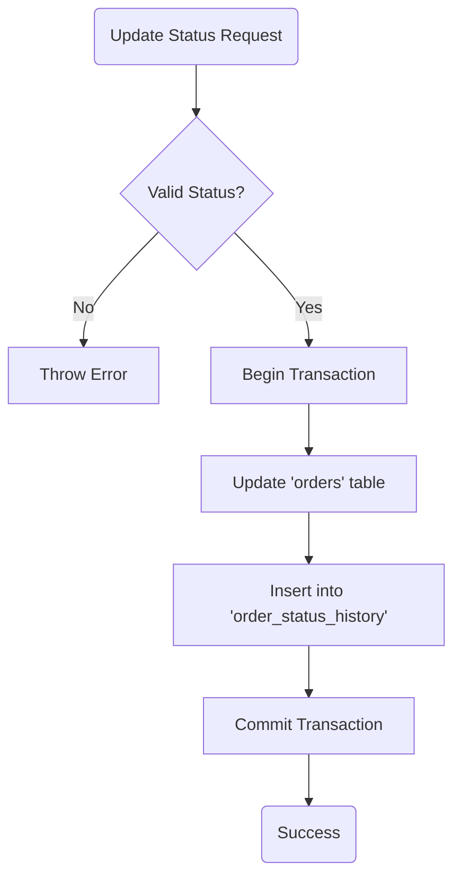
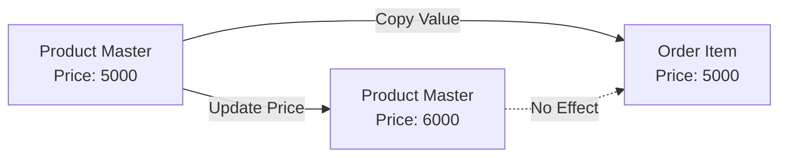

# DB Robot Operations & Logic Rules

**Component:** `DBRobot`
**Location:** [`server/agent.js`](../../server/agent.js)

## 1. Purpose
This document defines the mandatory **business logic and operational rules** that the Database Robot must enforce. These rules ensure data integrity, auditability, and consistent workflow execution across the Coolkonyha application.

## 2. Architecture/Flow (Logic Patterns)

### Dual-Write Pattern (Order Status)
Status changes must be atomic: update current state AND log history.

### Pricing Continuity Pattern
Prices in orders must be historical snapshots, not live references.

## 3. Input/Output Specifications (Rules)

### Relationship & Integrity Rules
-   **Products & Suppliers**: Every product in `products` must be linked to a valid `prod_supp_id` from the `product_suppliers` table.
-   **Pricing Continuity**: When an item is added to `order_items`, the Agent **MUST** copy the current `unit_price` from the `products` table into `order_items.unit_price`. Do NOT reference the live product price for historical orders.
-   **Order Totals**: The `orders.total_amount` must be the sum of (`quantity` * `unit_price`) for all related rows in `order_items`.

### Workflow Transition Rules (Dual-Write Policy)
Whenever an order status changes, the Agent MUST perform a dual-write operation:
1.  **Update `orders`**:
    -   Change `current_status` to the new `status_key`.
    -   Update `current_status_update` to the current timestamp.
    -   Summarize the trigger event in `update_event`.
2.  **Insert into `order_status_history`**:
    -   Create a new log entry with the same `status` and `update_event`.
    -   Identify itself or the trigger source in `performed_by`.

### Workflow Validation
-   **Status Source**: The Agent may only use statuses defined in the `business_status_workflow.status_key` column.
-   **Skippable Stages**: If the Agent detects that all items for an order are "In Stock", it may bypass the `PURCHASE` status only if `is_skippable` is set to `TRUE`.

### AI Summary Generation (update_event)
-   **Conciseness**: The `update_event` in the `orders` table should be a single, clear sentence (e.g., "AI processed incoming acceptance email").
-   **Depth**: The `update_event` in the `order_status_history` table should include more technical or contextual details if available.

### UI Presentation
-   Status colors are defined in CSS using the class pattern `.status-{status_key}` (e.g., `.status-new`, `.status-invoiced`).
-   The UI should apply the appropriate CSS class based on the `status_key` from `business_status_workflow` to ensure visual consistency.

## 4. Security Considerations

-   **Transaction Safety (All Write Methods)**: Every method that performs more than one DB write (`createOrder`, `addOrderItem`, `updateOrderStatus`) is wrapped in an explicit `BEGIN TRANSACTION` / `COMMIT` / `ROLLBACK` block. If the process is interrupted at any point mid-write, SQLite rolls back the entire operation automatically — no partial data is ever committed.
-   **Status Validation**: The Agent must validate that any target status exists in the `business_status_workflow` table before attempting an update to prevent invalid states.
-   **Price Freezing**: The Pricing Continuity rule is a financial security measure to prevent accidental modification of historical revenue data.

## Cross References
- **Implementation:** See [`server/agent.js`](../../server/agent.js)
- **Schema:** See [`docs/architecture/database-schema.md`](../architecture/database-schema.md)