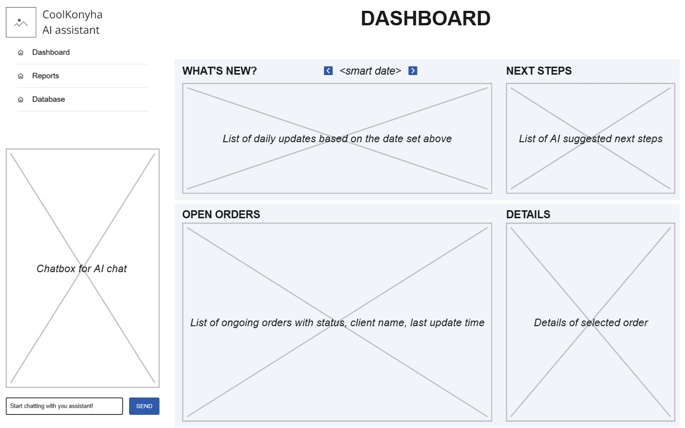

Let's start thinking together. CoolKonyha is a company that sells ice cube creator products all around the world. Let's call the owner and only employee who manager everything in the company CK. The coolkonyha-solo-vibe is about a local customer relationship manager, and business manager app. Its functionalities contain:

1. It can read CK's emails in Gmail, and from the emails tell in what status a business of order is. The statuses are defined in a business workflow stored already in our DB. 
2. Based on the businesses current statuses it can suggest the next steps needed to be taken to move the actual order to the next step of the workflow. Sometimes steps in the workflows may be skipped if that's what the business need. 
3. It can read and update the business information from the DB. It creates logs about every action, and knows every business's status.
4. It can handle belonging files and stores them on the computer it runs.
There are other functionalities that I did not described yet. Also, all these functionalities work logically, as a human assistant would do the work, meaning for example it makes sure that every email is processed once, checks if it finds a customer to the relevant email in the customer db, and so on. I did not describe every logical detail of the funcitonalities.

Here are the things I will want to create for the app:
1. I will want to create a dashboard as the startup screen where CK can see the ongoing orders, what has happened since last time the app was opened, and what are the suggested next steps.
2. The entire app will have different AI Agents that do the different work. There will be one Agent called the Manager, who will orchestrate all the work, call the agents, check the result and send it back for fixing if needed, and handle all the communication with CK.
3. On every page there should be an AI agent communication box, where CK can communicate with the Manager agent. 

I am going to descrire further functionalities and pages, but I want to get to a point where everything is functioning that is described above.

The application should be able to run with the least costs. 

Error handling should be able to catch any issues, and make it clear to CK what went wrong. Even if the app is offline, or the AI is not working at all.