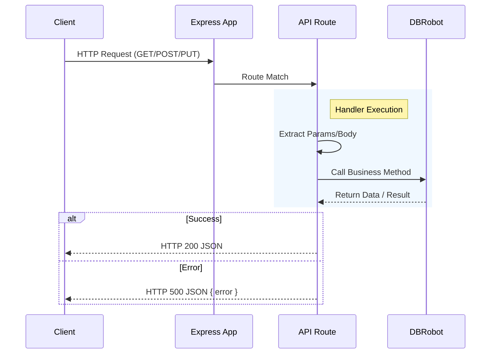

# API Routes Architecture

**Component:** `API Routes`
**Location:** [`server/routes.js`](../../server/routes.js)

## 1. Purpose
The API Routes module defines the **RESTful interface** for the Coolkonyha application. It handles HTTP requests, parses parameters, delegates business logic to the `DBRobot`, and formats responses.

Key responsibilities:
- **Routing:** Mapping HTTP methods and paths to handler functions.
- **Middleware:** applying CORS and Body Parser to requests.
- **Delegation:** Passing extracted data to `DBRobot` for processing.
- **Error Handling:** Catching errors from the agent and returning appropriate HTTP status codes (500, 400, etc.).

## 2. Architecture/Flow

### Request Flow


### Middleware Stack
1.  `cors()`: Allows cross-origin requests (essential for React frontend development).
2.  `bodyParser.json()`: Parses incoming JSON request bodies into `req.body`.
3.  `apiRouter`: Mounts all routes defined in `routes.js` to `/api`.

## 3. Input/Output Specifications

### Endpoint Reference

| Method | Path | Description | Request Body | Response | Agent Method |
| :--- | :--- | :--- | :--- | :--- | :--- |
| **GET** | `/api/customers` | Get all customers | - | `Array<Customer>` | `getCustomers()` |
| **PUT** | `/api/customers/:id` | Update customer | `{ cust_name, ... }` | `{ success: true }` | `updateCustomer()` |
| **GET** | `/api/suppliers` | Get all suppliers | - | `Array<Supplier>` | `getSuppliers()` |
| **PUT** | `/api/suppliers/:id` | Update supplier | `{ prod_supp_name, ... }` | `{ success: true }` | `updateSupplier()` |
| **GET** | `/api/products` | Get all products | - | `Array<Product>` | `getProducts()` |
| **PUT** | `/api/products/:id` | Update product | `{ prod_name, ... }` | `{ success: true }` | `updateProduct()` |
| **GET** | `/api/orders` | Get all orders | - | `Array<Order>` | `getOrders()` |
| **POST** | `/api/orders` | Create order | `{ custId, currency }` | `{ orderId: number }` | `createOrder()` |
| **GET** | `/api/orders/:id` | Get order details | - | `{ order, items, history }` | `getOrderDetails()` |
| **PUT** | `/api/orders/:id/status` | Update status | `{ status, performedBy, eventDescription }` | `{ success, newStatus }` | `updateOrderStatus()` |
| **POST** | `/api/orders/:id/items` | Add item to order | `{ prodId, quantity }` | `{ id: number }` | `addOrderItem()` |
| **GET** | `/api/workflow` | Get workflow statuses | - | `Array<Status>` | `getWorkflowStatuses()` |

### Example Request (Update Status)

**PUT** `/api/orders/101/status`

```json
{
  "status": "PROCESSING",
  "performedBy": "admin",
  "eventDescription": "Payment verified manually"
}
```

### Example Response

**HTTP 200 OK**

```json
{
  "success": true,
  "newStatus": "PROCESSING"
}
```

## 4. Security Considerations

- **CORS:** Currently configured to allow all origins (`cors()`). For production, this should be restricted to the specific frontend domain.
- **Input Validation:** Routes perform minimal validation, relying on `DBRobot` to enforce business rules and data integrity.
- **Error Exposure:** Stack traces are logged to the server console, but only error messages are returned to the client. Care is taken not to leak sensitive system paths in production (though currently, `err.message` is returned directly).
