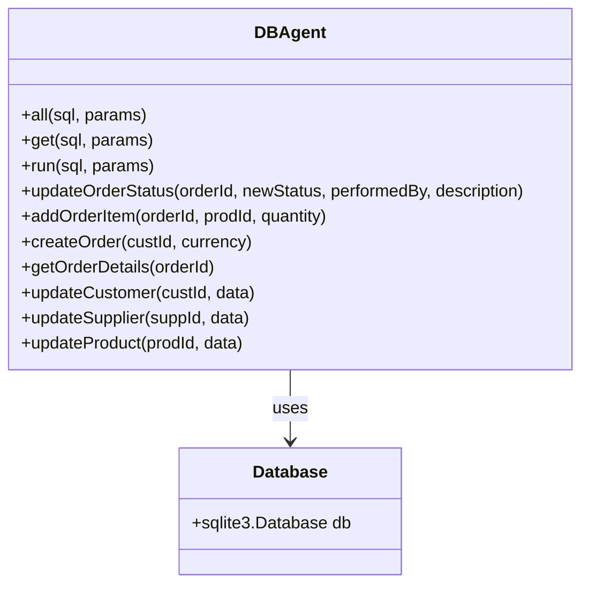
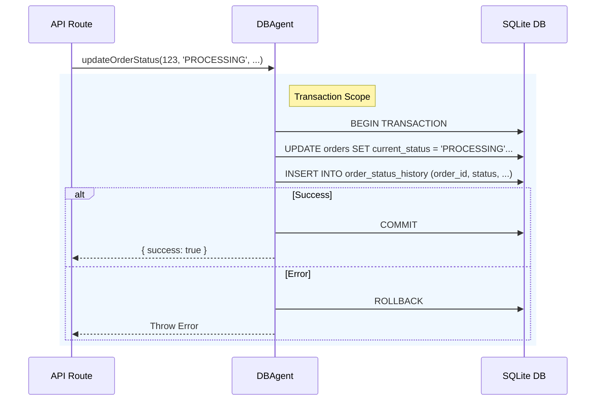
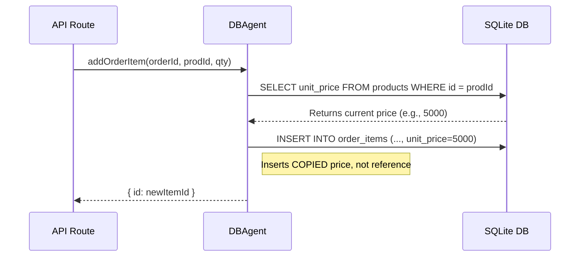

# Database Agent Architecture

**Component:** `DBAgent`
**Location:** [`server/agent.js`](file:///d:/dev/coolkonyha-solo-vibe/server/agent.js)

## 1. Purpose
The **Database Agent** acts as the centralized data access layer (DAL) for the Coolkonyha application. It abstracts all raw SQL operations and enforces critical business rules before data reaches the persistence layer.

Key responsibilities:
- **Centralized Data Access:** All database interactions flow through this class.
- **Business Rule Enforcement:** Implements rules like "Pricing Continuity" and "Dual-Write Status".
- **Promisification:** Wraps callback-based `sqlite3` driver methods into Promise-based methods for `async/await` usage.

## 2. Architecture/Flow

### Class Structure

### Dual-Write Pattern (Order Status)
This pattern ensures auditability by determining that every status change is recorded in both the current state (`orders` table) and the history log (`order_status_history`).

### Pricing Continuity Pattern
Ensures that the price of an item is frozen at the moment of ordering, so future product price changes do not affect historical orders.

## 3. Input/Output Specifications

| Method | Parameters | Returns | Throws |
|--------|------------|---------|--------|
| `updateOrderStatus` | `orderId` (int), `newStatus` (str), `performedBy` (str), `eventDescription` (str) | `{ success: boolean, newStatus: string }` | Invalid status, Transaction failure |
| `addOrderItem` | `orderId` (int), `prodId` (int), `quantity` (int) | `{ id: number }` (new item ID) | Product not found |
| `createOrder` | `custId` (int), `currency` (str, default 'HUF') | `{ orderId: number }` | Database error |
| `getOrderDetails` | `orderId` (int) | `{ order: Obj, items: Arr, history: Arr }` | Order not found |
| `updateCustomer` | `custId` (int), `data` (Obj) | `{ success: boolean }` | No fields to update |
| `updateSupplier` | `suppId` (int), `data` (Obj) | `{ success: boolean }` | No fields to update |
| `updateProduct` | `prodId` (int), `data` (Obj) | `{ success: boolean }` | No fields to update |

## 4. Security Considerations

- **SQL Injection Prevention:** All methods use parameterized queries (`?` placeholders) inherited from the base `sqlite3` driver.
- **Transaction Integrity:** Critical updates (like status changes) use explicit `BEGIN TRANSACTION` / `COMMIT` / `ROLLBACK` to ensure data consistency (ACID).
- **Foreign Key Enforcement:** The underlying database connection enables foreign keys via `PRAGMA foreign_keys = ON`, ensuring that invalid references (e.g., creating an order for a non-existent customer) are rejected by the database.
