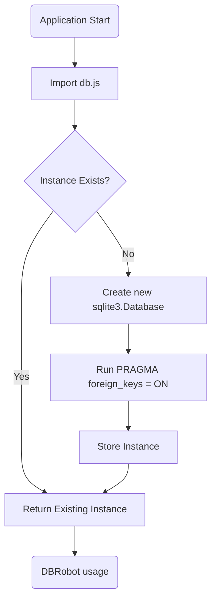

# Database Connection Architecture

**Component:** `Database Connection`
**Location:** [`server/db.js`](../../server/db.js)

## 1. Purpose
This module manages the low-level connection to the SQLite database. It ensures a single, shared connection instance is used throughout the application's lifecycle and enforces critical database configurations like foreign key constraints.

Key responsibilities:
- **Singleton Pattern:** Establishes connection once and exports the instance.
- **Integrity Enforcement:** Enables `PRAGMA foreign_keys = ON` immediately upon connection.
- **Path Resolution:** Correctly locates the database file relative to the server script.

## 2. Architecture/Flow

### Singleton Diagram


The database file is located at `../coolkonyha.db` relative to the `server/` directory.

## 3. Input/Output Specifications

- **Database File:** `coolkonyha.db` (SQLite 3 binary format)
- **Exports:** An instance of `sqlite3.Database`
- **Configuration:**
  - `foreign_keys`: **ON** (Crucial for relational integrity between orders, customers, and items).

### Code Snippet (`server/db.js`)
```javascript
class Database {
    constructor() {
        this.db = new sqlite3.Database(DB_PATH, (err) => {
            // ... error handling
            this.db.run('PRAGMA foreign_keys = ON;'); // Integrity Check
        });
    }
}
```

## 4. Security Considerations

- **File Permissions:** The `coolkonyha.db` file must be writable by the process running the Node.js server.
- **Concurrency:** SQLite handles locking automatically. Since this is a "Solo Vibe" (single-user or low-concurrency) application, the single connection model is appropriate and safe.
- **Data Integrity:** Foreign key enforcement prevents orphan records (e.g., creating an order for a deleted customer), which is a critical data security feature.
