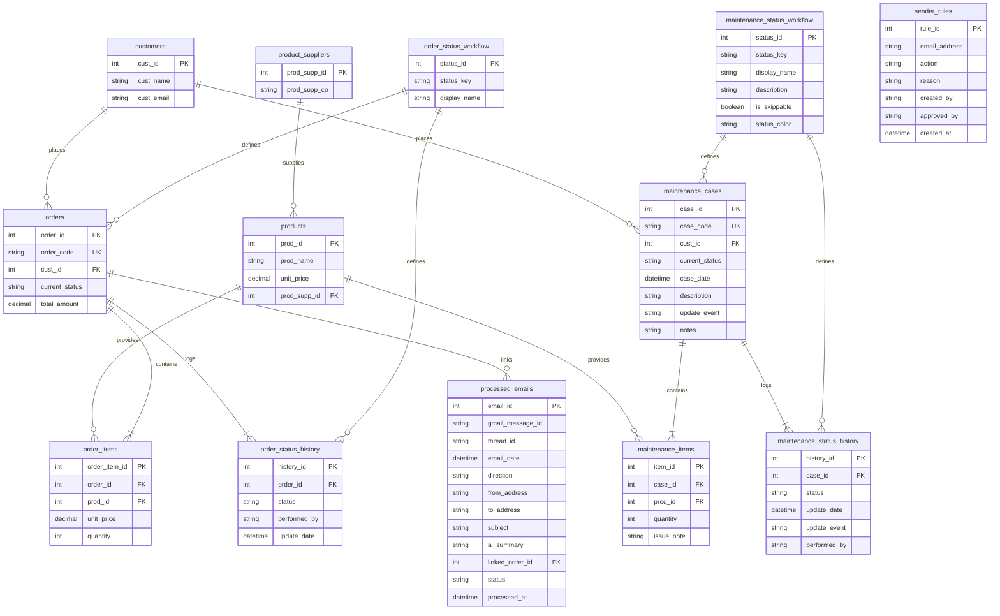

# Database Schema Architecture

**Component:** `Database Schema`
**Location:** [`coolkonyha.db`](../../coolkonyha.db)
**Version:** `v0.6.0`

## 1. Purpose
The Coolkonyha database uses a **hybrid relational model** designed for an AI-driven order management system. It balances two competing needs:
1.  **High-Performance Current State:** The `orders` and `maintenance_cases` tables provide instant access to the latest status of every transaction or case.
2.  **Complete Audit Traceability:** The `order_status_history` and `maintenance_status_history` tables maintain immutable logs of every workflow transition, crucial for AI context and debugging.

## 2. Architecture/Flow

### Entity-Relationship Diagram (ERD)

## 3. Input/Output Specifications (Schema Definitions)

### Master Data Tables

#### `customers`
Stores client CRM and contact information.
-   `cust_id` (PK): Unique identifier.
-   `cust_name`: Official name.
-   `cust_contact`: Primary contact person.
-   `cust_email`: Primary email.
-   `cust_note`: Internal notes.

#### `products`
Master list of products.
-   `prod_id` (PK): Unique identifier.
-   `prod_name`: Official name.
-   `unit_price`: **Current** base price (see `order_items` for historical).
-   `prod_supp_id` (FK): Link to `product_suppliers`.

#### `product_suppliers`
Stores supplier details.
-   `prod_supp_id` (PK): Unique identifier.
-   `prod_supp_co`: Company name.

### Transactional Tables (Order Domain)

#### `orders`
The "Head" of an order transaction.
-   `order_id` (PK): Unique identifier.
-   `order_code` (UNIQUE): Human-readable unique code (e.g., HILT-00001).
-   `cust_id` (FK): Customer reference.
-   `current_status`: The active state from `order_status_workflow`.
-   `update_event`: AI-generated summary of the last action.

#### `order_items`
Line items for orders.
-   `order_item_id` (PK): Unique identifier.
-   `order_id` (FK): Parent order.
-   `prod_id` (FK): Product reference.
-   `unit_price`: **Frozen** price at moment of purchase (Pricing Continuity Rule).
-   `quantity`: Amount purchased.

### Transactional Tables (Maintenance Domain)

#### `maintenance_cases`
The "Head" of a maintenance case transaction.
-   `case_id` (PK): Unique identifier.
-   `case_code` (UNIQUE): Human-readable unique case code (e.g., MAINT-00001).
-   `cust_id` (FK): Customer reference.
-   `case_date`: Date the case was opened.
-   `description`: Description of the reported issue.
-   `current_status`: The active state from `maintenance_status_workflow`.
-   `current_status_update`: Timestamp of the last status transition.
-   `update_event`: Human-friendly summary of the last status update.
-   `notes`: Internal maintenance notes.

#### `maintenance_items`
Line items for maintenance cases, linking to target products.
-   `item_id` (PK): Unique identifier.
-   `case_id` (FK): Parent maintenance case reference.
-   `prod_id` (FK): Product reference.
-   `quantity`: Number of items undergoing maintenance.
-   `issue_note`: Description of the specific defect/task for this product.

### Workflow Logic Tables

#### `order_status_history`
Immutable audit log for orders.
-   `history_id` (PK): Log entry ID.
-   `order_id` (FK): Order reference.
-   `status`: Status at that point in time.
-   `performed_by`: Agent/User ID.
-   `update_date`: Timestamp of the change.

#### `order_status_workflow`
Configuration for the order workflow state machine.
-   `status_id` (PK): Unique identifier.
-   `status_key` (UNIQUE): Programmatic key (e.g., `OFFER_SENT`).
-   `display_name`: Human-readable label.

#### `maintenance_status_history`
Immutable audit log for maintenance cases.
-   `history_id` (PK): Log entry ID.
-   `case_id` (FK): Maintenance case reference.
-   `status`: Status key at that point in time.
-   `update_date`: Timestamp of the change.
-   `update_event`: Summary of the change context.
-   `performed_by`: Agent/User ID.

#### `maintenance_status_workflow`
Configuration for the maintenance workflow state machine.
-   `status_id` (PK): Unique identifier.
-   `status_key` (UNIQUE): Programmatic status key.
-   `display_name`: Human-readable status label.
-   `description`: Explanation of what this workflow stage means.
-   `is_skippable`: Logic flag for automation workflows.
-   `status_color`: Hex code or tag color for frontend rendering.

### Email Processing Table

#### `processed_emails`
Ledger of every email processed by the Email Robot. The single source of truth for deduplication.
-   `email_id` (PK): Unique identifier.
-   `gmail_message_id` (UNIQUE): Gmail's immutable message ID — the dedup key.
-   `thread_id`: Groups emails in the same conversation thread.
-   `email_date`: When the email was sent/received.
-   `direction`: `received` or `sent` — determines which Gmail folder was monitored.
-   `ai_summary`: The Manager Agent's interpretation of the **newest message block only** (quoted history is stripped before AI processing).
-   `linked_order_id` (FK, nullable): The order this email relates to. Null if unmatched or spam.
-   `status`: Processing state — `pending`, `processed`, `failed`, or `skipped`.
-   `processed_at`: Timestamp when the agent finished processing.

#### `sender_rules`
Stores CK's learned preferences for non-customer email senders. Rules are proposed by P.I.S.T.A. and approved by CK.
-   `rule_id` (PK): Unique identifier.
-   `email_address` (UNIQUE): The sender email address the rule applies to.
-   `action`: Disposition — `skip` (ignore silently), `notify` (always show to CK), or `auto_customer` (treat as customer lead).
-   `reason`: Human-readable explanation of why the rule was created.
-   `created_by`: Who proposed the rule (`CK` or `PISTA`).
-   `approved_by`: Who approved the rule — always `CK`.
-   `created_at`: When the rule was created.

## 4. Security Considerations

-   **Foreign Key Integrity:** `PRAGMA foreign_keys = ON` is enforced by the [`Database Connection`](./database-connection.md) to prevent orphaned records.
-   **Data Consistency:** The `orders` / `maintenance_cases` tables and their respective status history tables MUST be updated in the same transaction (Dual-Write Policy) to ensure the current state always matches the latest history entry.
-   **Price Freezing:** `order_items.unit_price` MUST be populated at insertion time to protect financial records from future price changes in the `products` table. (Note: `maintenance_items` does not store unit prices as maintenance is priced as a separate service cost on completion or covered under warranty).

## Cross References
- **Business Rules:** See [`docs/assistant_team/db_robot_logic_tools.md`](../assistant_team/db_robot_logic_tools.md)
- **Data Access:** See [`server/robots/`](../../server/robots/) (see [database-robot.md](../assistant_team/database-robot.md) for the current file layout)
- **P.I.S.T.A. (sender_rules consumer):** See [`docs/assistant_team/pista-agent.md`](./pista-agent.md)
- **Email Robot (sender_rules consumer):** See [`docs/assistant_team/email-robot.md`](./email-robot.md)
