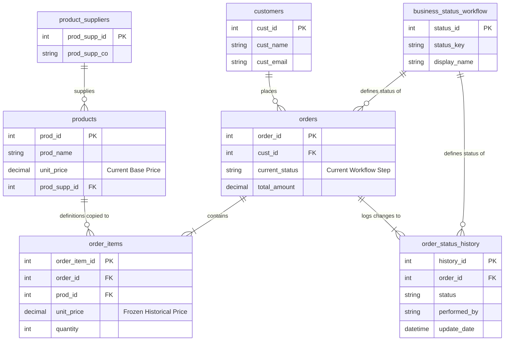

# Database Schema Architecture

**Component:** `Database Schema`
**Location:** [`coolkonyha.db`](../../coolkonyha.db)

## 1. Purpose
The Coolkonyha database uses a **hybrid relational model** designed for an AI-driven order management system. It balances two competing needs:
1.  **High-Performance Current State:** The `orders` table provides instant access to the latest status of every transaction.
2.  **Complete Audit Traceability:** The `order_status_history` table maintains an immutable log of every workflow transition, crucial for AI context and debugging.

## 2. Architecture/Flow

### Entity-Relationship Diagram (ERD)

## 3. Input/Output Specifications (Schema Definitions)

### Master Data Tables

#### `customers`
Stores client CRM and contact information.
-   `cust_id` (PK): Unique identifier.
-   `cust_name`: Official name.
-   `cust_contact`: Primary contact person.
-   `cust_email`: Primary email.
-   `cust_note`: Internal notes.

#### `products`
Master list of products.
-   `prod_id` (PK): Unique identifier.
-   `prod_name`: Official name.
-   `unit_price`: **Current** base price (see `order_items` for historical).
-   `prod_supp_id` (FK): Link to `product_suppliers`.

#### `product_suppliers`
Stores supplier details.
-   `prod_supp_id` (PK): Unique identifier.
-   `prod_supp_co`: Company name.

### Transactional Tables

#### `orders`
The "Head" of a transaction.
-   `order_id` (PK): Unique identifier.
-   `cust_id` (FK): Customer reference.
-   `current_status`: The active state from `business_status_workflow`.
-   `update_event`: AI-generated summary of the last action.

#### `order_items`
Line items for orders.
-   `order_item_id` (PK): Unique identifier.
-   `order_id` (FK): Parent order.
-   `prod_id` (FK): Product reference.
-   `unit_price`: **Frozen** price at moment of purchase (Pricing Continuity Rule).
-   `quantity`: Amount purchased.

### Workflow Logic Tables

#### `order_status_history`
Immutable audit log.
-   `history_id` (PK): Log entry ID.
-   `order_id` (FK): Order reference.
-   `status`: Status at that point in time.
-   `performed_by`: Agent/User ID.

#### `business_status_workflow`
Configuration for the workflow state machine.
-   `status_key`: Programmatic key (e.g., `OFFER_SENT`).
-   `is_skippable`: Logic flag for AI automation.

## 4. Security Considerations

-   **Foreign Key Integrity:** `PRAGMA foreign_keys = ON` is enforced by the [`Database Connection`](./database-connection.md) to prevent orphaned records.
-   **Data Consistency:** The `orders` table and `order_status_history` table MUST be updated in the same transaction (Dual-Write Policy) to ensure the current state always matches the latest history entry.
-   **Price Freezing:** `order_items.unit_price` MUST be populated at insertion time to protect financial records from future price changes in the `products` table.

## Cross References
- **Business Rules:** See [`docs/agent_logics/db_agent_logic_tools.md`](../agent_logics/db_agent_logic_tools.md)
- **Data Access:** See [`server/agent.js`](../../server/agent.js)
