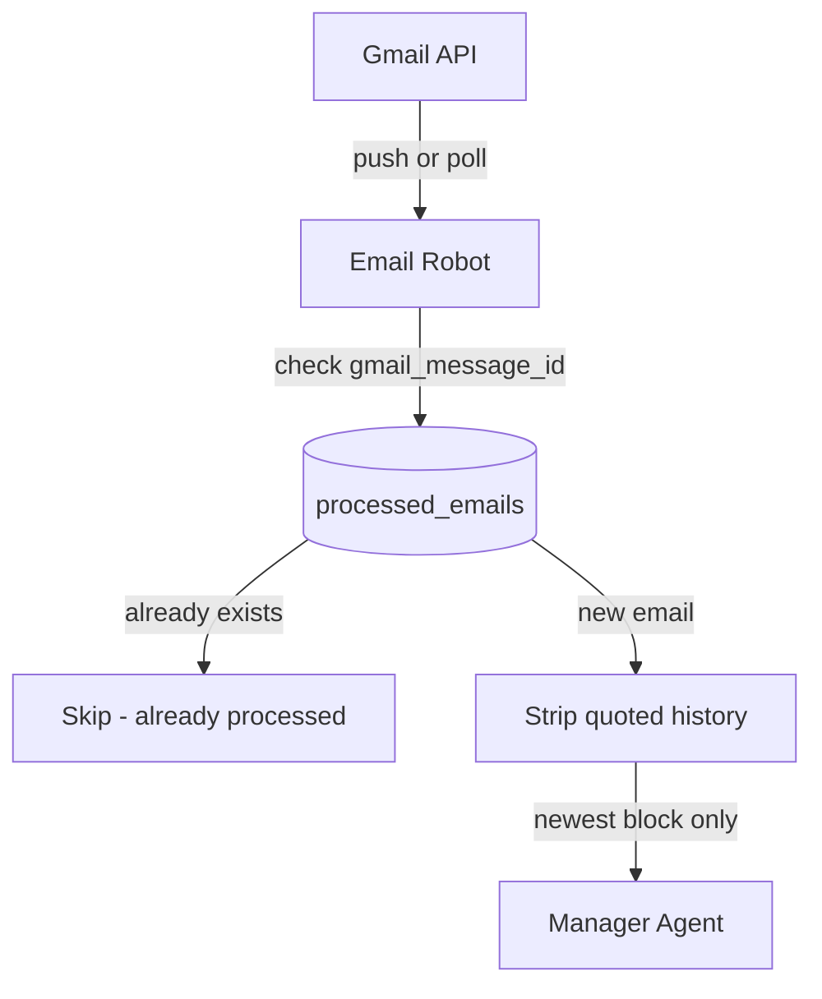

# Email Robot Architecture

**Component:** `Email Robot`
**Type:** 🤖 Robot (deterministic, no AI)
**Status:** Planned — not yet implemented

## 1. Purpose

The **Email Robot** is a mechanical connector with a single job: fetch emails from Gmail and hand them to the Manager Agent for processing. It contains **no AI reasoning** — it only retrieves, deduplicates, and delivers raw data.

Key responsibilities:
- **Fetch:** Monitor both `INBOX` and `SENT` folders in Gmail via the Gmail API
- **Deduplicate:** Check each email's `gmail_message_id` against the `processed_emails` table — skip any already seen
- **Strip:** Remove quoted email history from the body, keeping only the newest message block
- **Deliver:** Pass the clean payload to the Manager Agent for interpretation

## 2. Architecture/Flow



### Trigger Methods

| Method | Description |
|---|---|
| **Push (preferred)** | Gmail `watch()` API sends a Pub/Sub notification on any mailbox event — near real-time |
| **Polling (fallback)** | `setInterval` checking Gmail API every N minutes — simpler but adds latency |

### Deduplication Logic

1. Fetch new messages from Gmail API
2. For each `gmail_message_id`: query `processed_emails` table
3. If found → skip entirely
4. If not found → insert a `pending` row, then strip body and hand off to Manager Agent

## 3. Input/Output Specifications

### Inputs
- Gmail API: list of message IDs from INBOX and SENT since last check
- `processed_emails` table: existing message IDs

### Outputs (payload to Manager Agent)

```json
{
  "gmail_message_id": "18e3f...",
  "thread_id": "18e3f...",
  "email_date": "2026-03-09T18:00:00Z",
  "direction": "received",
  "from_address": "client@example.com",
  "to_address": "ck@coolkonyha.com",
  "subject": "Re: Offer for 100 units",
  "newest_body_block": "Thanks, we accept the offer. Please confirm delivery."
}
```

## 4. Security Considerations

- **OAuth2 only:** Gmail API access must use OAuth2 tokens stored as environment variables — never hardcoded credentials.
- **Read-only Gmail scope:** The robot only needs `gmail.readonly` — it must not request write permissions.
- **Minimal data:** Only the newest message block is forwarded — full email bodies are never stored in the DB.
- **Dedup is the safety net:** The `gmail_message_id UNIQUE` constraint in `processed_emails` provides a second layer of protection against duplicate processing even if the robot's in-memory state is lost.

## Cross References
- **Manager Agent:** [`docs/architecture/manager-agent.md`](./manager-agent.md)
- **DB Schema (processed_emails):** [`docs/architecture/database-schema.md`](./database-schema.md)
- **Solution Design:** [`SOLUTION_DESIGN.md`](../../SOLUTION_DESIGN.md)
