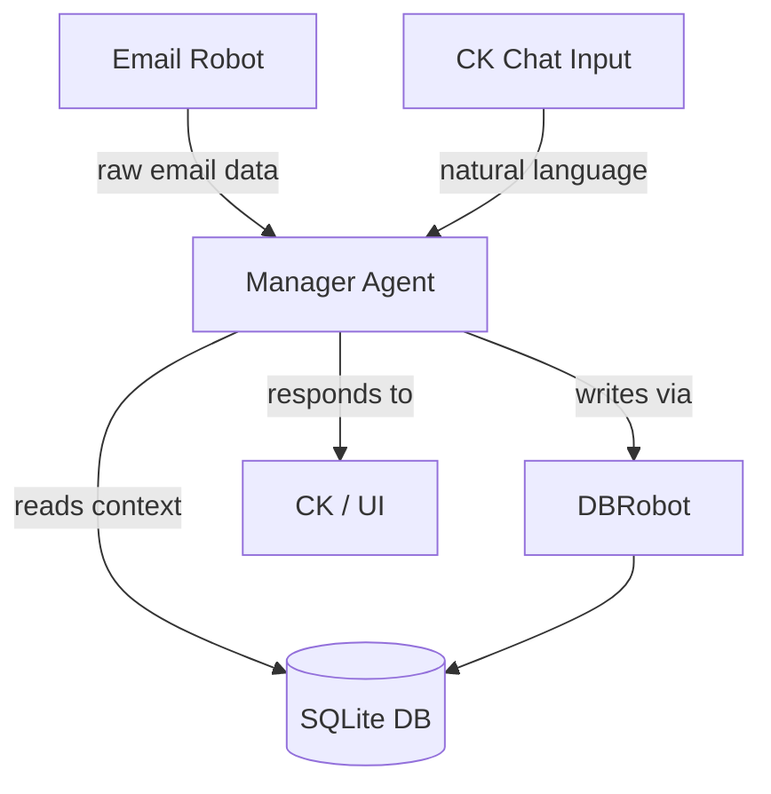

# Manager Agent Architecture

**Component:** `Manager Agent`
**Type:** 🧠 AI Agent
**Status:** Planned — not yet implemented

## 1. Purpose

The **Manager Agent** is the single AI-powered actor in the Coolkonyha system. It is responsible for:

- **Interpreting** incoming information (emails via the Email Robot, or manual input from CK via the chat box)
- **Reading context** from the database (orders, email history, status history) to build a complete picture before responding
- **Updating** the database via the DBRobot when a status change or log entry is needed
- **Communicating** back to CK with summaries, next step suggestions, and answers to questions

The Manager Agent is the *only* component in the system that uses an LLM. Everything else is deterministic.

## 2. Architecture/Flow

### Trigger Sources

| Source | How it reaches the Manager |
|---|---|
| New email (received or sent) | Email Robot fetches → passes to Manager |
| CK chat message | Direct input via app chat box |

### Processing Flow

1. Receive event (email payload or chat message)
2. Read relevant DB context: linked order, status history, recent processed emails
3. Strip quoted history from email body — only interpret newest message block
4. Generate `ai_summary` and determine required action (status change, log entry, or just a reply)
5. Write to DB via DBRobot if action needed
6. Respond to CK with a clear, concise message

## 3. Input/Output Specifications

### Inputs
- **From Email Robot:** `{ gmail_message_id, direction, from, to, subject, newest_body_block }`
- **From CK chat:** Natural language string

### Outputs
- **To DB (via DBRobot):** Updated `processed_emails`, `order_status_history`, `orders`
- **To CK:** Plain language response, summary, or suggested next steps

## 4. Architectural Decisions

### Decision: Single Agent for Processing and Communication

**Question:** Should the Manager Agent be split into a separate *Processing Agent* (handles emails) and *Manager Agent* (handles CK communication)?

**Decision: No — keep one Manager Agent.**

**Rationale:**

- **LLM calls are stateless.** The Manager Agent is not a running process that can be "occupied". Each invocation (email processing or CK chat) is an independent API call. There is no blocking — both can run in parallel.
- **The DB is the shared memory.** The Agent reads fresh context from the database on every call. A separate Processing Agent would provide no additional context that the Manager Agent can't already access directly.
- **Splitting creates information loss risk.** If the Manager Agent had to query a Processing Agent to answer CK's questions, it would only know what that agent chose to pass on — losing full context.
- **Scale does not justify it.** Splitting agents makes sense at high email volume (thousands/day) or when different LLM models are required for different tasks. Neither applies to CoolKonyha.

**CK availability is guaranteed by event architecture, not agent separation:**
- CK chat input always gets priority handling — it is never queued behind email processing.
- Email processing events and chat input events are separate triggers to the same Agent.

**Future re-evaluation:** If email volume grows substantially or cost control requires a cheaper model for background processing, revisit this decision.

## 5. Security Considerations

- The Manager Agent must **never** write directly to the DB — all writes go through DBRobot to ensure business rules (dual-write, pricing continuity) are enforced.
- AI-generated summaries stored in `processed_emails.ai_summary` and `order_status_history.update_event` must not contain PII beyond what is operationally necessary.
- All LLM calls must use environment variable API keys — never hardcoded.

## Cross References
- **DBRobot:** [`server/agent.js`](../../server/agent.js)
- **Email Robot:** [`docs/architecture/email-robot.md`](./email-robot.md)
- **DB Schema:** [`docs/architecture/database-schema.md`](./database-schema.md)
- **Solution Design:** [`SOLUTION_DESIGN.md`](../../SOLUTION_DESIGN.md)
