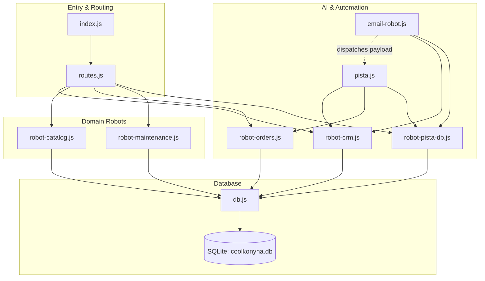

# Living Module Map

Welcome to the Coolkonyha Solo Vibe module map. This directory contains lightweight summaries of all core backend and automation modules in the project.

## Module Index

- [index.js](index.js.md) — Express application entry point that initializes middleware, static routes, and starts the HTTP server.
- [db.js](db.js.md) — Singleton SQLite database connection provider enforcing foreign key constraints.
- [routes.js](routes.js.md) — Express router mapping REST API endpoints to domain robot operations.
- [pista.js](pista.js.md) — P.I.S.T.A. AI business manager reasoning on emails and chat to propose actions for CK.
- [robot-crm.js](robot-crm.js.md) — Data access robot for customer records and email-based lookups.
- [robot-catalog.js](robot-catalog.js.md) — Data access robot managing suppliers and product catalogue items.
- [robot-orders.js](robot-orders.js.md) — Orders domain robot enforcing pricing continuity and dual-write status updates.
- [robot-maintenance.js](robot-maintenance.js.md) — Maintenance domain robot managing repair cases, items, and dual-write audit logs.
- [robot-pista-db.js](robot-pista-db.js.md) — Persistence robot for P.I.S.T.A. chat history, processed email logs, and sender rules.
- [email-robot.js](email-robot.js.md) — Deterministic Gmail polling worker for deduplicating, stripping, and forwarding emails.

### Frontend

- [index.html](index.html.md) — SPA shell: sidebar, modals, theme toggle logic, and `#app-content` container for dynamic view injection.

> **Note:** The `ui_design/` layer (router, controllers, views, CSS) is not yet fully mapped. Module map entries for this layer will be created during the v0.9.0 React migration phase.

## Dependency Graph

## Start Here Guide

- **If you are working on REST API endpoints or adding new HTTP routes:**
  Read [routes.js](routes.js.md) first to understand existing routes and response codes, then read the matching domain robot ([robot-orders.js](robot-orders.js.md), [robot-crm.js](robot-crm.js.md), [robot-catalog.js](robot-catalog.js.md), or [robot-maintenance.js](robot-maintenance.js.md)).
- **If you are working on Order processing or status transitions:**
  Read [robot-orders.js](robot-orders.js.md) first to understand Pricing Continuity and Dual-Write rules, then [routes.js](routes.js.md).
- **If you are working on Maintenance cases or repairs:**
  Read [robot-maintenance.js](robot-maintenance.js.md) first to understand case workflows and status history logging, then [routes.js](routes.js.md).
- **If you are working on Customer, Supplier, or Product catalogs:**
  Read [robot-crm.js](robot-crm.js.md) or [robot-catalog.js](robot-catalog.js.md) for data access rules, and [routes.js](routes.js.md) for exposed routes.
- **If you are working on P.I.S.T.A. AI behavior or prompt engineering:**
  Read [pista.js](pista.js.md) to inspect system prompts, token safeguards, and proposal structures, then read [robot-pista-db.js](robot-pista-db.js.md) for conversation persistence.
- **If you are working on Gmail integration, email filtering, or deduplication:**
  Read [email-robot.js](email-robot.js.md) to follow the 8-step pipeline, [robot-pista-db.js](robot-pista-db.js.md) for deduplication queries and sender rules, and [pista.js](pista.js.md) for AI handoff.
- **If you are working on Database connections, transactions, or schema:**
  Read [db.js](db.js.md) for connection and foreign key setup, followed by the relevant domain robot in `server/robots/`.
- **If you are working on the SPA shell, sidebar, theme, or modals:**
  Read [index.html](index.html.md) first. For view content see `ui_design/views/`. For routing see `ui_design/js/router.js`.
