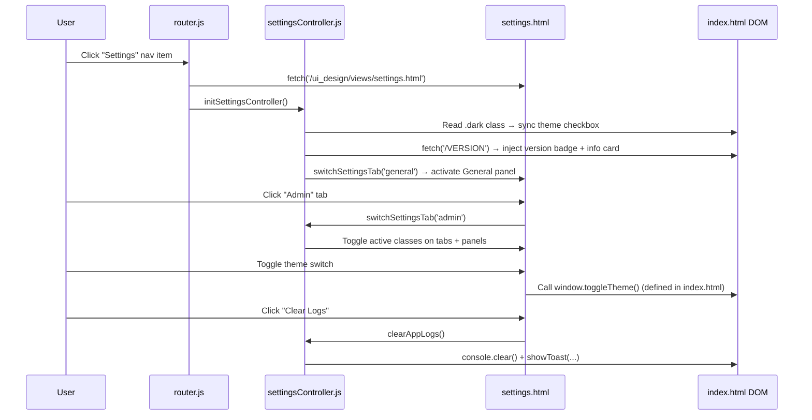

# Settings View

**Version introduced:** v0.7.1  
**Location:** `ui_design/views/settings.html` + `ui_design/js/controllers/settingsController.js`

---

## 1. Purpose

The Settings view provides a centralised interface for user-facing configuration (General section) and privileged system administration (Admin section). It integrates into the existing CoolKonyha SPA router without requiring a page reload.

---

## 2. Architecture / Flow

### Key Design Decisions
- **No backend calls:** All settings in v0.7.1 are client-side only.
- **Global function exposure:** `switchSettingsTab`, `resetSidebarWidth`, and `clearAppLogs` are exposed on `window` so `onclick` attributes in the injected HTML fragment can reach them.
- **Single toast element:** `showToast()` lazily creates one `#app-toast` element appended to `<body>` and reuses it for all notifications.

---

## 3. Input / Output Specifications

### initSettingsController()

| Aspect | Detail |
|--------|--------|
| **Called by** | `router.js` after injecting `settings.html` into `#app-content` |
| **Side effects** | Syncs theme checkbox, fetches version, activates General tab |
| **Dependencies** | `window.toggleTheme` (index.html), `/VERSION` endpoint |

### switchSettingsTab(tabName)

| Parameter | Type | Values |
|-----------|------|--------|
| `tabName` | string | `'general'` \| `'admin'` |

Toggles `.active` class on `.settings-tab-btn` elements and `.settings-section` panels.

### showToast(message)

| Parameter | Type | Detail |
|-----------|------|--------|
| `message` | string | Text to display in the bottom-right toast |

Auto-hides after 3 000 ms. Creates `#app-toast` if not already in the DOM.

### `/VERSION` endpoint

- **Method:** GET (static file served by Vite dev server)
- **Response:** Plain text, e.g. `0.7.1\n`
- **Error handling:** Logs to console, leaves version elements as `—`

---

## 4. Security Considerations

- **Admin tab always visible:** No authentication is implemented in v0.7.1. The Admin tab is visible to all users. This is a known limitation to be addressed when an auth layer is introduced.
- **No sensitive data displayed:** The system info card shows only stack/environment information, not credentials, API keys, or PII.
- **Feature flags are read-only:** All toggle inputs in the Feature Flags table are `disabled`; they cannot be toggled by the user.
- **No direct DB access:** The "Clear Logs" action only calls `console.clear()` client-side. No server-side log files are modified.

---

## Cross References

- [SOLUTION_DESIGN.md](../../SOLUTION_DESIGN.md) — Component Responsibility Matrix
- [UI Data Flow](./ui-data-flow.md) — SPA routing and data binding patterns
- [router.js](../../ui_design/js/router.js) — Route registration
