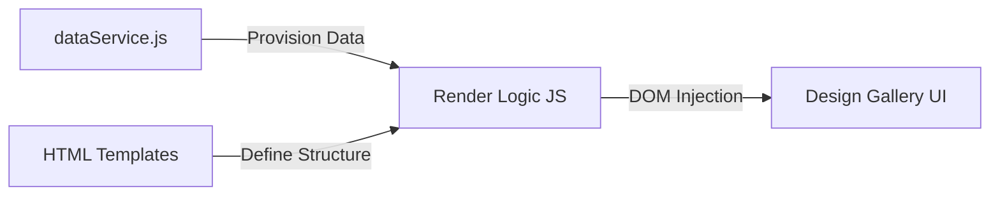

# UI Data Flow Architecture

## Purpose
The purpose of this architecture is to implement **Separation of Concerns** in the CoolKonyha UI, specifically the Design Gallery. It decouples the data management logic from the visual presentation, allowing for easier maintenance, scalability, and the ability to update UI styles without modifying the data retrieval logic.

## Architecture/Flow
The system follows a **Template-Based Vanilla MVC** pattern:
1.  **Model (Data Service):** `dataService.js` acts as the single source of truth for all UI data (Orders, Updates, status labels).
2.  **View (HTML Templates):** Each design file contains `<template>` tags that define the structure of repeatable UI elements (e.g., table rows).
3.  **Controller (Render Logic):** JavaScript in the design files fetches data from `dataService.js`, clones the appropriate `<template>`, populates it with data, and injects it into the DOM.

## Input/Output specifications
### Data Service (`dataService.js`)
- **Inputs:** External data fetched via Express REST API endpoints (`/api/customers`, `/api/suppliers`, etc.).
- **Outputs:** 
    - `getOrders()`: Array of Order objects.
    - `getUpdates()`: Array of Update objects.
    - `getOrderDetails(id)`: Object containing Order, History, Items, and Files.
    - `getStatusLabel(key)`: String label for a status key.

### Render Logic
- **Inputs:** Data from `dataService.js`, cloned DOM fragments from `<template>`.
- **Outputs:** Updated DOM elements in the dashboard.

## Security considerations
- **Data Sanitization:** When injecting text into templates, `textContent` is used instead of `innerHTML` to prevent XSS attacks.
- **Volatile Memory:** Raw data is stored in memory via the `dataService` and is not persisted on the client side in an unencrypted state (to be aligned with the project's AES-256 encryption rules).
