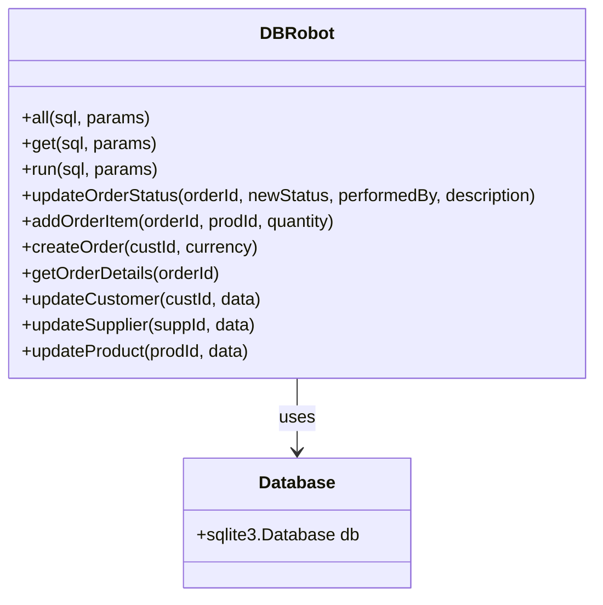
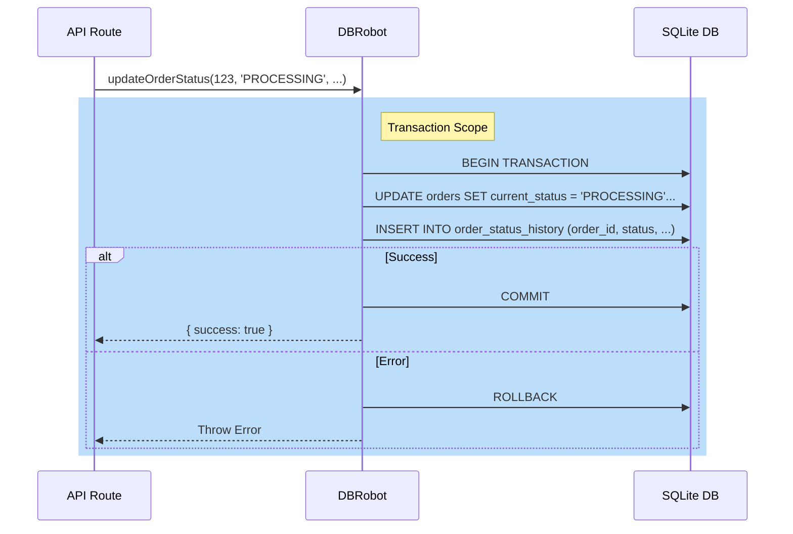
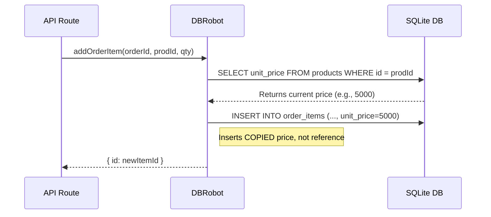
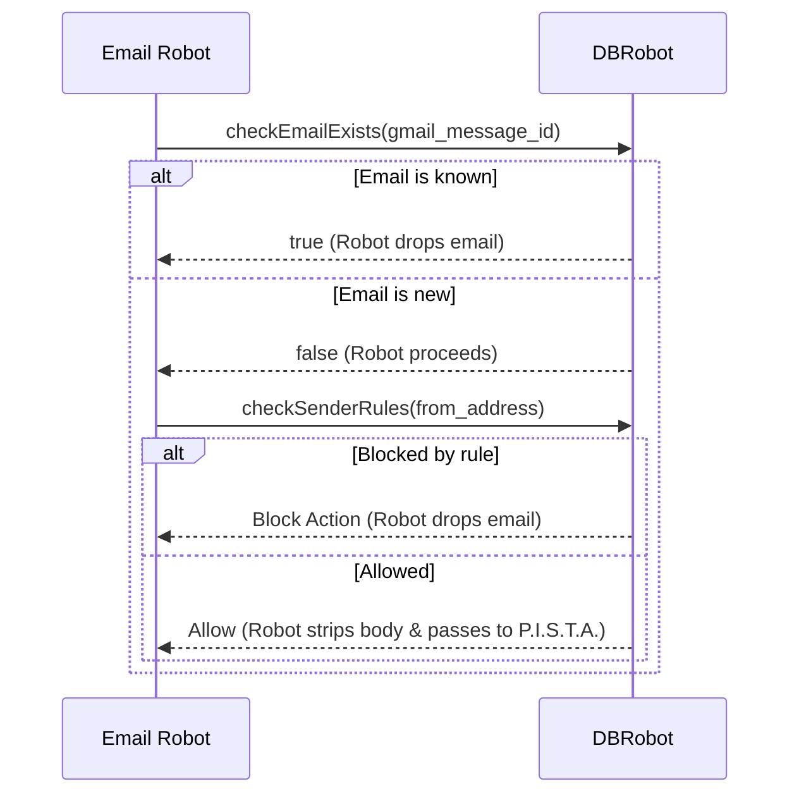
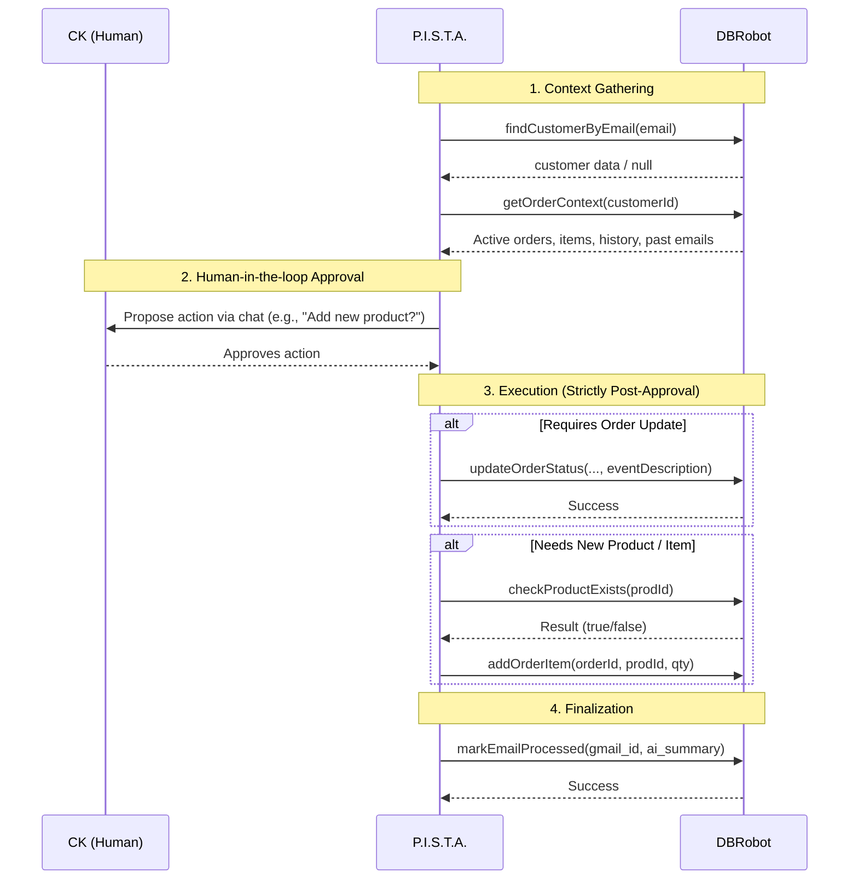

# Database Robot Architecture

**Component:** `DBRobot`
**Location:** Split across five domain modules under [`server/robots/`](../../server/robots/) — [`robot-crm.js`](../../server/robots/robot-crm.js), [`robot-catalog.js`](../../server/robots/robot-catalog.js), [`robot-orders.js`](../../server/robots/robot-orders.js), [`robot-maintenance.js`](../../server/robots/robot-maintenance.js), [`robot-pista-db.js`](../../server/robots/robot-pista-db.js) — consumed by [`server/routes.js`](../../server/routes.js).

> **Note:** The original monolithic implementation of this layer (formerly at the top level of `server/`, before the `server/robots/` split — see [module map](../architecture/module-map/index.md)) carried no live logic and was retired to [`.trash/server/agent.js`](../../.trash/server/agent.js) on 2026-09-03. Treat any other reference to the old path elsewhere as historical unless it's inside a dated `docs/.impl_plans/` or `docs/.versions/` record.

## 1. Purpose
The **Database Robot** is a deterministic (non-AI) data access layer for the Coolkonyha application. It abstracts all raw SQL operations and enforces critical business rules mechanically before data reaches the persistence layer. The rules and flows described below are conceptually unchanged from the original monolith — only the file layout changed.

Key responsibilities:
- **Centralized Data Access:** All database interactions flow through this class.
- **Business Rule Enforcement:** Implements rules like "Pricing Continuity" and "Dual-Write Status".
- **Promisification:** Wraps callback-based `sqlite3` driver methods into Promise-based methods for `async/await` usage.

## 2. Architecture/Flow

### Class Structure

### Dual-Write Pattern (Order Status)
This pattern ensures auditability by determining that every status change is recorded in both the current state (`orders` table) and the history log (`order_status_history`).

### Pricing Continuity Pattern
Ensures that the price of an item is frozen at the moment of ordering, so future product price changes do not affect historical orders.

## 3. Inter-Agent Workflows (API Contract)

The DBRobot acts as the sole gatekeeper to the database. It provides specific services (endpoints) to the other operational robots and agents to ensure they never touch raw data.

### 3.1 Services for Email Robot

**Goal:** Deduplicate emails and enforce basic sender rules before the AI agent even wakes up.

### 3.2 Services for P.I.S.T.A. (Manager Agent)

**Goal:** Provide context for reasoning and execute AI-driven updates *only after human approval*.

## 4. Input/Output Specifications

| Method | Parameters | Returns | Throws |
|--------|------------|---------|--------|
| `updateOrderStatus` | `orderId` (int), `newStatus` (str), `performedBy` (str), `eventDescription` (str) | `{ success: boolean, newStatus: string }` | Invalid status, Transaction failure |
| `addOrderItem` | `orderId` (int), `prodId` (int), `quantity` (int) | `{ id: number }` (new item ID) | Product not found |
| `createOrder` | `custId` (int), `currency` (str, default 'HUF') | `{ orderId: number }` | Database error |
| `getOrderDetails` | `orderId` (int) | `{ order: Obj, items: Arr, history: Arr }` | Order not found |
| `updateCustomer` | `custId` (int), `data` (Obj) | `{ success: boolean }` | No fields to update |
| `updateSupplier` | `suppId` (int), `data` (Obj) | `{ success: boolean }` | No fields to update |
| `updateProduct` | `prodId` (int), `data` (Obj) | `{ success: boolean }` | No fields to update |

## 5. Security Considerations

- **SQL Injection Prevention:** All methods use parameterized queries (`?` placeholders) inherited from the base `sqlite3` driver.
- **Transaction Integrity:** Critical updates (like status changes) use explicit `BEGIN TRANSACTION` / `COMMIT` / `ROLLBACK` to ensure data consistency (ACID).
- **Foreign Key Enforcement:** The underlying database connection enables foreign keys via `PRAGMA foreign_keys = ON`, ensuring that invalid references (e.g., creating an order for a non-existent customer) are rejected by the database.
