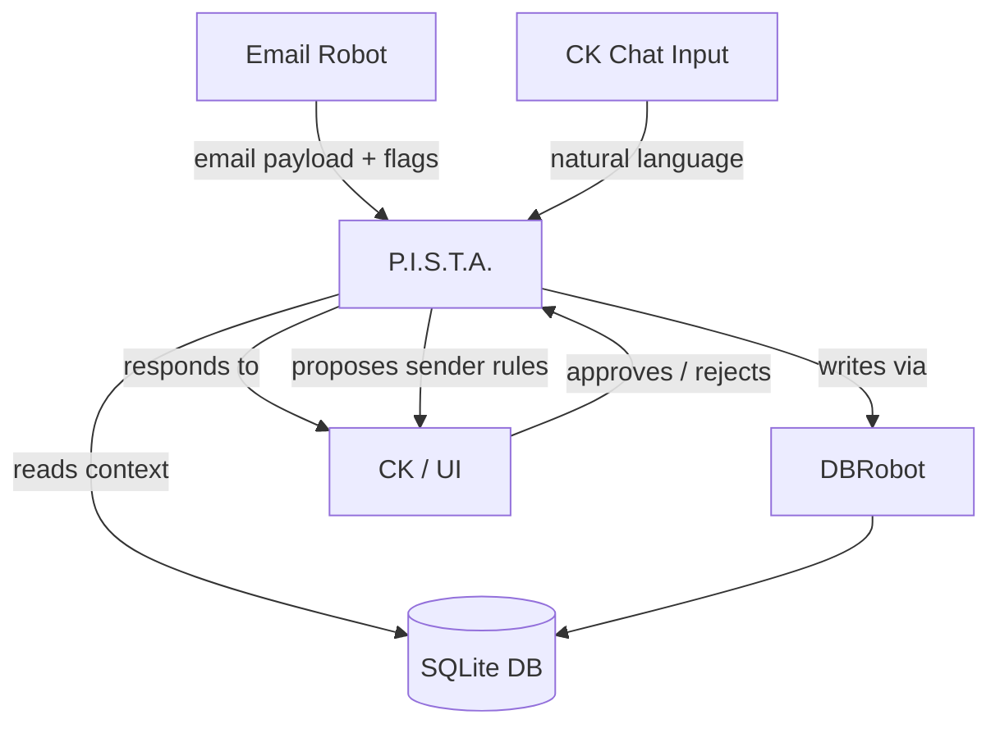
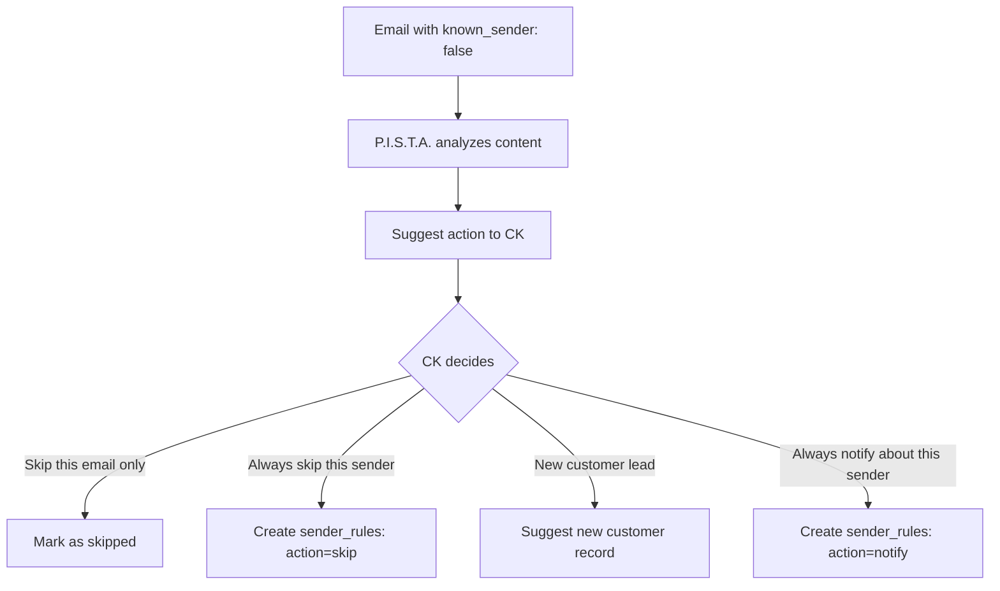

# P.I.S.T.A. — Agent Architecture

**Full name:** **P**roactive **I**ntelligent **S**ystem for **T**ask **A**utomation
**Component:** `P.I.S.T.A.`
**Type:** 🧠 Agent (AI)
**Status:** Planned — not yet implemented

## 1. Purpose

**P.I.S.T.A.** is the single AI-powered actor in the Coolkonyha system, acting as a highly professional **Senior Business Project Manager**. It is responsible for:

- **Business Management & Workflow Monitoring:** Continuously monitoring the state of orders, identifying stuck processes or delayed replies, and proactively suggesting interventions to CK to ensure business rules and workflows are strictly followed.
- **Interpreting** incoming information (emails via the Email Robot, or manual input from CK via the chat box).
- **Reading context** from the database (orders, email history, status history) to build a complete picture before responding.
- **Updating** the database via the DBRobot when a status change or log entry is needed (only after human approval).
- **Learning** CK's sender preferences and applying them to future email filtering.
- **Communicating** back to CK with summaries, next step suggestions, and answers to questions.

**Constraint - Local First:** The Coolkonyha application (including P.I.S.T.A.'s execution runtime and the database) is designed to run locally on CK's machine as an easily installable standalone application. P.I.S.T.A. only reaches out to the external internet for the **Gemini LLM API** and incoming/outgoing Gmail sync.

P.I.S.T.A. is the *only* component in the system that uses an LLM. Everything else is deterministic.

## 2. Architecture/Flow

### Trigger Sources

| Source | How it reaches P.I.S.T.A. |
|---|---|
| New email (received or sent) | Email Robot fetches → passes to P.I.S.T.A. with `known_sender` and `rule` flags |
| CK chat message | Direct input via app chat box |
| Scheduled Health Check | A local cron or scheduled interval invokes P.I.S.T.A. to query DBRobot for stuck/aging orders |

### Processing Flow

1. Receive event (email payload or chat message)
2. Read relevant DB context: linked order, status history, recent processed emails
3. If email event with `known_sender: false` → run **Unknown Sender Handling** (see below)
4. Strip quoted history from email body — only interpret newest message block
5. Generate `ai_summary` and determine required action (status change, log entry, or just a reply)
6. **Propose** action to CK for approval — never execute outbound actions autonomously
7. On CK approval → write to DB via DBRobot
8. Respond to CK with a clear, concise message

### Attachment Handling Workflow (Security-First)

Due to the "Local First" architecture, automatically downloading email attachments introduces significant security risks (malware, ransomware). P.I.S.T.A. handles attachments via a strict human-in-the-loop quarantine process:

1. **Detection:** The Email Robot passes attachment metadata (filename, size) and a Gmail URL to P.I.S.T.A.
2. **Warning & Proposal:** P.I.S.T.A. halts automatic processing and proposes an action to CK:
   *"CK, csatolmány érkezett (tervrajz.pdf). Kérlek, nyisd meg a megadott Gmail linken és ellenőrizd, hogy biztonságos-e. Ha igen, másold be nekem a tartalmát, foglald össze, vagy töltsd fel ide a chatbe, hogy lementhessem a rendeléshez!"*
3. **Manual Upload & Storage:** If CK uploads the file via the chat interface, the system encrypts the file at rest (AES-256), saves it to `/data/attachments/` with a UUID filename, and P.I.S.T.A. logs a reference to this file in the `order_status_history` table.

### Unknown Sender Handling

When the Email Robot delivers an email with `known_sender: false`, P.I.S.T.A. uses LLM reasoning to assess relevance and presents CK with options:

**Key rules:**
- P.I.S.T.A. **suggests**, CK **decides**. The Agent never creates sender rules autonomously.
- Domain-based filtering (e.g., "skip everything from `*@newsletters.example.com`") is handled through P.I.S.T.A.'s LLM reasoning — the Agent can suggest domain-level rules when appropriate, but the `sender_rules` table stores exact email addresses. P.I.S.T.A. pattern-matches at inference time.
- CK can always change or revoke any learned rule via chat (e.g., "Pista, stop ignoring emails from X").

### Daily Delta Summary

P.I.S.T.A. can produce a "What happened since last login?" summary on demand:

- Queries `order_status_history` for changes since a given timestamp
- Groups results by customer and order
- Presents a concise narrative summary, not a raw data dump
- This is a **read-only** capability — no writes, no special infrastructure

## 3. Input/Output Specifications

### Inputs
- **From Email Robot:** `{ gmail_message_id, direction, from, to, subject, newest_body_block, known_sender, rule }`
- **From CK chat:** Natural language string

### Outputs
- **To DB (via DBRobot):** Updated `processed_emails`, `order_status_history`, `orders`, `sender_rules`
- **To CK:** Plain language response, summary, suggested next steps, or approval request

## 4. Architectural Decisions

### Decision: Single Agent for Processing and Communication

**Question:** Should P.I.S.T.A. be split into a separate *Processing Agent* (handles emails) and *Communication Agent* (handles CK chat)?

**Decision: No — keep one Agent.**

**Rationale:**

- **LLM calls are stateless.** P.I.S.T.A. is not a running process that can be "occupied". Each invocation (email processing or CK chat) is an independent API call. There is no blocking — both can run in parallel.
- **The DB is the shared memory.** P.I.S.T.A. reads fresh context from the database on every call. A separate Processing Agent would provide no additional context that P.I.S.T.A. can't already access directly.
- **Splitting creates information loss risk.** If P.I.S.T.A. had to query a separate agent to answer CK's questions, it would only know what that agent chose to pass on — losing full context.
- **Scale does not justify it.** Splitting agents makes sense at high email volume (thousands/day) or when different LLM models are required for different tasks. Neither applies to CoolKonyha.

**CK availability is guaranteed by event architecture, not agent separation:**
- CK chat input always gets priority handling — it is never queued behind email processing.
- Email processing events and chat input events are separate triggers to the same Agent.

**Future re-evaluation:** If email volume grows substantially or cost control requires a cheaper model for background processing, revisit this decision.

## 5. Security Considerations

- P.I.S.T.A. must **never** write directly to the DB — all writes go through DBRobot to ensure business rules (dual-write, pricing continuity) are enforced.
- AI-generated summaries stored in `processed_emails.ai_summary` and `order_status_history.update_event` must not contain PII beyond what is operationally necessary.
- All LLM calls must use environment variable API keys — never hardcoded.

### Human-in-the-Loop Approval

P.I.S.T.A.'s output is always a **proposal** — CK approves or rejects.

| Action | Requires CK approval? |
|---|---|
| Sending outgoing emails | ✅ Yes — always |
| Changing order status | ✅ Yes — always |
| Creating a new customer record | ✅ Yes — always |
| Creating/modifying sender rules | ✅ Yes — always |
| Reading data, generating summaries | ❌ No |
| Answering CK's questions | ❌ No |

**Rule:** P.I.S.T.A. may prepare, draft, and suggest — but never execute outbound or destructive actions without explicit CK confirmation.

## Cross References
- **DBRobot:** [`server/agent.js`](../../server/agent.js)
- **Email Robot:** [`docs/assistant_team/email-robot.md`](./email-robot.md)
- **DB Schema:** [`docs/architecture/database-schema.md`](./database-schema.md)
- **Solution Design:** [`SOLUTION_DESIGN.md`](../../SOLUTION_DESIGN.md)
