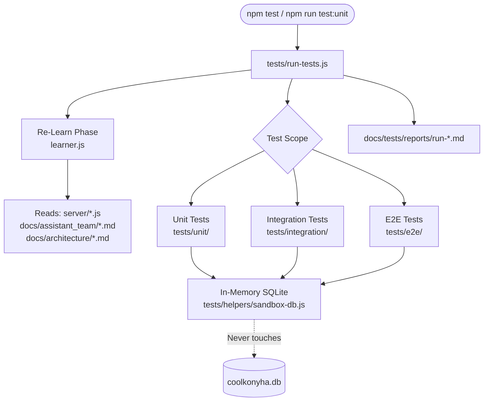

# Test Agent — Documentation

**Location:** `tests/`  
**Version:** 1.0.0

## 1. Purpose

The Test Agent provides automated unit, integration, and E2E testing for the Coolkonyha system. It runs in complete isolation using an in-memory SQLite sandbox — the production `coolkonyha.db` is never opened during tests.

Before each test run, the agent performs a **Re-Learn Phase**: it reads the current source code and documentation for the components under test, ensuring tests always reflect the actual implementation.

## 2. Architecture / Flow



## 3. How to Run

```bash
# Run all tests
npm test

# Run only unit tests
npm run test:unit

# Run only integration tests
npm run test:integration

# Run only E2E tests
npm run test:e2e
```

Each run prints a summary table to stdout and saves a timestamped report to `docs/tests/reports/`.

## 4. Folder Structure

```
tests/
├── helpers/
│   ├── learner.js          # Re-Learn Phase — reads scoped source + docs
│   ├── sandbox-db.js       # In-memory SQLite with full schema
│   ├── fixtures.js         # Deterministic seed data factories
│   ├── agent-factory.js    # Injectable DBRobot for unit tests
│   └── test-app-factory.js # Injectable Express app for HTTP tests
├── unit/
│   └── agent.unit.test.js  # DBRobot business logic tests
├── integration/
│   └── routes.integration.test.js  # REST API HTTP contract tests
├── e2e/
│   └── order-lifecycle.e2e.test.js # Full order lifecycle test
└── run-tests.js            # Test Agent orchestrator / reporter
```

## 5. Re-Learn Scopes

| Scope | Files Read Before Test |
|---|---|
| `unit` | `tests/helpers/agent-factory.js` mirror source (`.trash/server/agent.js`, retired — see note below), `docs/assistant_team/db_robot_logic_tools.md`, `docs/assistant_team/db_robot_code_structure.md` |
| `integration` | `server/routes.js`, all files under `server/robots/`, `docs/architecture/api-routes.md`, `docs/assistant_team/db_robot_logic_tools.md` |
| `e2e` | All of the above + `server/index.js`, `docs/architecture/database-schema.md` |
| `all` | Union of all scopes |

> **Known gap:** the `unit` scope's tests run against `tests/helpers/agent-factory.js`, which mirrors the retired `.trash/server/agent.js` (moved out of `server/` 2026-09-03, was never imported by the live server) rather than the current `server/robots/robot-orders.js` / `robot-maintenance.js`. Integration and E2E tests do exercise the real robot files via the HTTP layer. See `docs/assistant_team/db_robot_code_structure.md` for detail.

## 6. Test Reports

Every run generates `docs/tests/reports/run-<ISO-timestamp>.md` containing:
- Pass/fail/skip counts
- A list of failed test names and their errors
- The full **Re-Learn Phase manifest** (which files were read and when)

## 7. Security Considerations

- **Sandbox isolation:** All tests use `:memory:` SQLite. The production DB path (`coolkonyha.db`) is not referenced anywhere in the test code.
- **Random ports:** Integration and E2E tests bind Express to port `0` (OS-assigned random port) so they never conflict with the production server on port 3001.
- **Read-only re-learn:** The learner only reads files; it never writes outside of `docs/tests/reports/`.

---

*See also:*
- [unit-tests.md](./unit-tests.md)
- [integration-tests.md](./integration-tests.md)
- [e2e-tests.md](./e2e-tests.md)
