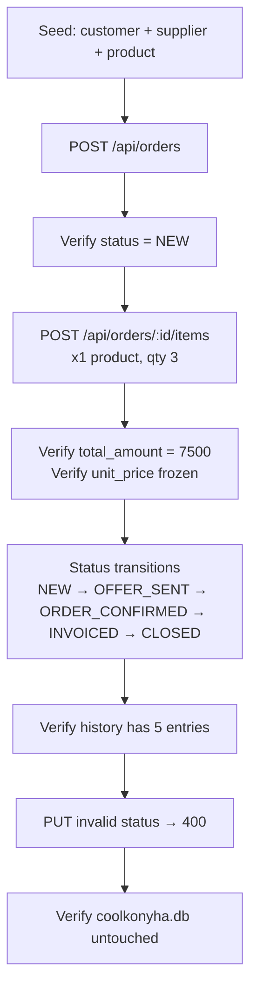

# E2E Tests — Full Order Lifecycle

**File:** [`tests/e2e/order-lifecycle.e2e.test.js`](../../tests/e2e/order-lifecycle.e2e.test.js)  
**Re-Learn Scope:** `e2e` (full system)

## 1. Purpose

Validates the complete order lifecycle from creation to closure, exercising the HTTP API, DBAgent business rules, and the SQLite persistence layer together.

## 2. Architecture / Flow

## 3. Test Steps

| Step | Action | Success Criteria |
|---|---|---|
| 1 | `POST /api/orders` | `orderId > 0`; status = `NEW` |
| 2 | `POST /api/orders/:id/items` (qty 3, price 2500) | `total_amount = 7500`; `unit_price` frozen |
| 3a | Update status → `OFFER_SENT` | HTTP 200, current_status updated |
| 3b | Update status → `ORDER_CONFIRMED` | HTTP 200, current_status updated |
| 3c | Update status → `INVOICED` | HTTP 200, current_status updated |
| 3d | Update status → `CLOSED` | HTTP 200, current_status updated |
| 4 | `GET /api/orders/:id` | History has 5 entries (NEW + 4 transitions) |
| 5 | Update status → `GHOST_STATUS` | HTTP 400 with error message |
| 6 | Direct DB query | `order_id` exists only in sandbox `:memory:`, not in `coolkonyha.db` |

## 4. Input/Output Specifications

- Seeded product price: **2500 HUF**
- Items added: **3 units → expected total: 7500 HUF**
- Expected history count: **5** (1 initial `NEW` + 4 transitions)

## 5. Security Considerations

- Full-scope re-learn reads all server source files and docs before running
- Sandbox DB: in-memory only; closed after suite teardown
- Production DB safety explicitly verified in Step 6

*See also:* [docs/agent_logics/db_agent_logic_tools.md](../agent_logics/db_agent_logic_tools.md)
