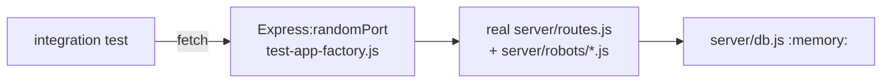

# Integration Tests — REST API Routes

**File:** [`tests/integration/routes.integration.test.js`](../../tests/integration/routes.integration.test.js)  
**Re-Learn Scope:** `integration`

## 1. Purpose

Verifies the HTTP contract of every REST endpoint by running a real Express server on a random port, backed by a sandbox in-memory SQLite database. Tests use the built-in `fetch()` API.

## 2. Architecture / Flow

## 3. Test Cases

| Method | Endpoint | Expected | What is verified |
|---|---|---|---|
| GET | `/api/customers` | 200, array | Returns seeded customer |
| GET | `/api/suppliers` | 200, array | Returns seeded supplier |
| GET | `/api/products` | 200, array | Returns seeded product |
| GET | `/api/workflow` | 200, array[10] | All 10 statuses present |
| POST | `/api/orders` | 200, `{orderId}` | Order creation |
| GET | `/api/orders/:id` | 200, `{order, items, history}` | Order detail shape |
| PUT | `/api/orders/:id/status` (valid) | 200, `{success:true}` | Valid status update |
| PUT | `/api/orders/:id/status` (invalid) | 400, `{error}` | Invalid status rejected |
| POST | `/api/orders/:id/items` | 200, `{id}` | Item added |
| PUT | `/api/customers/:id` | 200, `{success:true}` | Customer updated |

## 4. Input/Output Specifications

- Server binds to port `0` (random) — no conflict with production server (3001)
- All requests/responses use `application/json`
- Error responses follow `{ error: string }` shape

## 5. Security Considerations

- Production server never started during tests
- No real port 3001 binding
- In-memory DB; production `coolkonyha.db` never opened

*See also:* [docs/architecture/api-routes.md](../architecture/api-routes.md)
