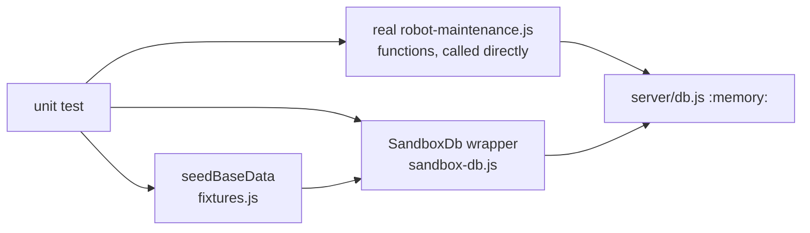

# Unit Tests — Maintenance Robot Business Logic

**File:** [`tests/unit/maintenance.unit.test.js`](../../tests/unit/maintenance.unit.test.js)
**Re-Learn Scope:** `unit`

## 1. Purpose

Verifies the core business rules of the real `server/robots/robot-maintenance.js` functions directly, in isolation, using an in-memory sandbox DB with no server running. Mirrors the orders unit suite's structure — see [unit-tests.md](./unit-tests.md) — but the maintenance domain has no Pricing Continuity equivalent (`maintenance_items` carries no price).

## 2. Architecture / Flow

## 3. Test Cases

### `createMaintenanceCase()`
| # | Test | Verifies |
|---|---|---|
| 1 | Inserts row with NEW status and an `SZ<YY><NN>` code | Case creation + code generation, matching CK's own Excel numbering (see `docs/.notes/differences-for-CK.md`) |
| 2 | Case code sequence resets per calendar year, increments within it | Yearly-reset counter, not a flat global one |
| 3 | Accepts an `assignedTo` value | New field (2026-09-05), maps to `assigned_to` |
| 4 | Creates initial NEW history entry | Dual-write on creation |
| 5 | Accepts a null description | Optional param handling |

### `updateMaintenanceStatus()` — Dual-Write Rule
| # | Test | Verifies |
|---|---|---|
| 6 | Updates `maintenance_cases.current_status` (to `SCHEDULED`) | First write |
| 7 | Inserts history row | Second write (audit log) |
| 8 | Throws on invalid status | Status validation fires before DB write |
| 9 | `maintenance_cases` unchanged after invalid status | Atomicity / fail-safe |

### `addMaintenanceItem()`
| # | Test | Verifies |
|---|---|---|
| 10 | Inserts item with quantity + issue note | Field mapping |
| 11 | Rejects a nonexistent product | Foreign key enforcement |

### `updateMaintenanceCase()` (added 2026-09-05 — field edits, not status transitions)
| # | Test | Verifies |
|---|---|---|
| 12 | Updates `assigned_to` and `pricing_note` together | New fields matching CK's "Ki intézi?" / "mikor_mi_összeg" columns |
| 13 | Only updates the field(s) explicitly provided | Dynamic field-list builder, same pattern as `updateCustomer`/`updateProduct` |
| 14 | Throws when no fields are provided | Input validation |

### `getMaintenanceWorkflowStatuses()` / `getMaintenanceDetails()`
| # | Test | Verifies |
|---|---|---|
| 15 | Returns all 9 seeded workflow statuses | Seed data / read path — revised status list (`QUOTE_SENT`, `SCHEDULED`, `WAITING`, `IN_REPAIR`, `ON_HOLD` replacing the old `DIAGNOSED`/`PARTS_ORDERED`/`TESTING`/`INVOICED`), still 9 total |
| 16 | Returns case + items + history together | Detail aggregation |

## 4. Input/Output Specifications

All tests receive seeded data from `seedBaseData()`: 1 customer, 1 supplier, 1 product.

## 5. Security Considerations

- No production DB access; all writes go to `:memory:` only (`server/db.js` itself, switched via `DB_PATH`)
- Fully isolated from the Orders domain — no shared tables

*See also:* [unit-tests.md](./unit-tests.md), [docs/assistant_team/db_robot_logic_tools.md](../assistant_team/db_robot_logic_tools.md)
