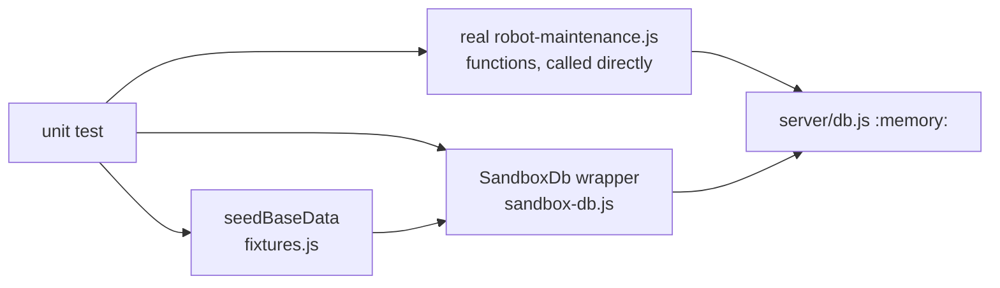

# Unit Tests — Maintenance Robot Business Logic

**File:** [`tests/unit/maintenance.unit.test.js`](../../tests/unit/maintenance.unit.test.js)
**Re-Learn Scope:** `unit`

## 1. Purpose

Verifies the core business rules of the real `server/robots/robot-maintenance.js` functions directly, in isolation, using an in-memory sandbox DB with no server running. Mirrors the orders unit suite's structure — see [unit-tests.md](./unit-tests.md) — but the maintenance domain has no Pricing Continuity equivalent (`maintenance_items` carries no price).

## 2. Architecture / Flow

## 3. Test Cases

### `createMaintenanceCase()`
| # | Test | Verifies |
|---|---|---|
| 1 | Inserts row with NEW status and a `MAINT-#####` code | Case creation + code generation |
| 2 | Creates initial NEW history entry | Dual-write on creation |
| 3 | Accepts a null description | Optional param handling |

### `updateMaintenanceStatus()` — Dual-Write Rule
| # | Test | Verifies |
|---|---|---|
| 4 | Updates `maintenance_cases.current_status` | First write |
| 5 | Inserts history row | Second write (audit log) |
| 6 | Throws on invalid status | Status validation fires before DB write |
| 7 | `maintenance_cases` unchanged after invalid status | Atomicity / fail-safe |

### `addMaintenanceItem()`
| # | Test | Verifies |
|---|---|---|
| 8 | Inserts item with quantity + issue note | Field mapping |
| 9 | Rejects a nonexistent product | Foreign key enforcement |

### `getMaintenanceWorkflowStatuses()` / `getMaintenanceDetails()`
| # | Test | Verifies |
|---|---|---|
| 10 | Returns all 9 seeded workflow statuses | Seed data / read path |
| 11 | Returns case + items + history together | Detail aggregation |

## 4. Input/Output Specifications

All tests receive seeded data from `seedBaseData()`: 1 customer, 1 supplier, 1 product.

## 5. Security Considerations

- No production DB access; all writes go to `:memory:` only (`server/db.js` itself, switched via `DB_PATH`)
- Fully isolated from the Orders domain — no shared tables

*See also:* [unit-tests.md](./unit-tests.md), [docs/assistant_team/db_robot_logic_tools.md](../assistant_team/db_robot_logic_tools.md)
