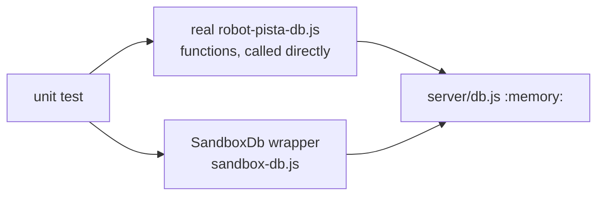

# Unit Tests — PISTA DB Robot Business Logic

**File:** [`tests/unit/pista-db.unit.test.js`](../../tests/unit/pista-db.unit.test.js)
**Re-Learn Scope:** `unit`

## 1. Purpose

Verifies the real `server/robots/robot-pista-db.js` functions directly, in isolation, using an in-memory sandbox DB with no server running.

**Intentionally not covered:** `saveChatMessage()` and `getChatHistory()`. Both reference a `pista_chat_logs` table that does not exist in production — see `docs/.notes/bugs.md` b-8. Adding it to the sandbox schema just to make tests pass would make `docs/setup_complete_db.sql` diverge from real production, defeating the accuracy guarantee established in the i-2 test-suite retargeting. Creating the table for real is a feature decision tied to wiring P.I.S.T.A. into the live server (i-3), not a test-writing task.

**Bugs found and fixed while writing this suite:** `getRecentEmailsByAddress()` and `insertPendingEmail()` queried `sender_email`/`receiver_email` — columns that don't exist on `processed_emails` (the real columns are `from_address`/`to_address`). `getSenderRule()` gained the same graceful-degradation try/catch its sibling `getSenderRules()` already had.

## 2. Architecture / Flow

## 3. Test Cases

### Processed Emails
| # | Test | Verifies |
|---|---|---|
| 1 | `insertPendingEmail()` inserts a row with status `pending` | Basic insert, correct column mapping |
| 2 | `insertPendingEmail()` is idempotent on duplicate message ID | `INSERT OR IGNORE` dedup key |
| 3 | `updateEmailStatus()` updates status + `ai_summary` | Field update |
| 4 | `getRecentEmailsByAddress()` finds by `from_address`/`to_address` | Column-name bugfix verification |
| 5 | `getRecentEmailsByAddress()` returns `[]` for an unknown address | Empty-result path |
| 6 | `filterUnprocessedEmailIds()` excludes known IDs | Deduplication logic |
| 7 | `filterUnprocessedEmailIds()` handles an empty input array | Edge case |
| 8 | `getProcessedEmails()` returns rows with `linked_order_code` (null when unlinked) | Join behavior |

### Sender Rules — graceful degradation (table doesn't exist yet)
| # | Test | Verifies |
|---|---|---|
| 9 | `getSenderRules()` returns `[]` instead of throwing | Existing graceful-degradation guard |
| 10 | `getSenderRule()` returns `undefined` instead of throwing | Newly added graceful-degradation guard |

## 4. Input/Output Specifications

No shared fixtures required — each test seeds its own email rows directly via `insertPendingEmail()`.

## 5. Security Considerations

- No production DB access; all writes go to `:memory:` only (`server/db.js` itself, switched via `DB_PATH`)
- Deliberately does not exercise the chat-log functions rather than paper over the missing table — see `docs/.notes/bugs.md` b-8

*See also:* [unit-tests.md](./unit-tests.md), [docs/assistant_team/pista-agent.md](../assistant_team/pista-agent.md)
