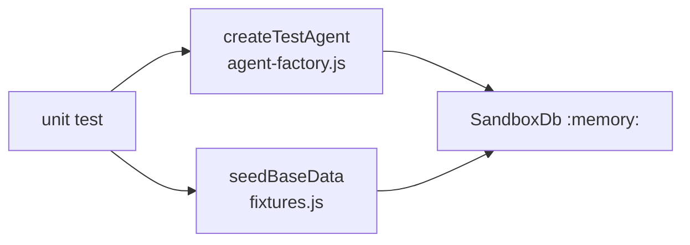

# Unit Tests — DBAgent Business Logic

**File:** [`tests/unit/agent.unit.test.js`](../../tests/unit/agent.unit.test.js)  
**Re-Learn Scope:** `unit`

## 1. Purpose

Verifies the core business rules of the `DBAgent` class in isolation, using an in-memory sandbox DB with no server running.

## 2. Architecture / Flow

## 3. Test Cases

### `createOrder()`
| # | Test | Verifies |
|---|---|---|
| 1 | Inserts row with NEW status | Orders table populated |
| 2 | Creates initial NEW history | Dual-write on creation |
| 3 | Defaults currency to HUF | Default param behaviour |
| 4 | Respects custom currency | Param forwarding |

### `updateOrderStatus()` — Dual-Write Rule
| # | Test | Verifies |
|---|---|---|
| 5 | Updates `orders.current_status` | First write |
| 6 | Inserts history row | Second write (audit log) |
| 7 | Throws on invalid status | Status validation fires before DB write |
| 8 | Orders table unchanged after invalid status | Atomicity / fail-safe |

### `addOrderItem()` — Pricing Continuity Rule
| # | Test | Verifies |
|---|---|---|
| 9 | Freezes unit_price at order time | Pricing Continuity rule |
| 10 | Recalculates `total_amount` correctly | Order total recalculation |
| 11 | Frozen price survives product price change | Historical isolation |
| 12 | Throws when product not found | Input validation |

### `updateCustomer()` / `updateProduct()`
| # | Test | Verifies |
|---|---|---|
| 13 | Updates allowed fields | Field-level update |
| 14 | Throws when no fields provided | Input validation |

## 4. Input/Output Specifications

All tests receive seeded data from `seedBaseData()`:
- 1 customer, 1 supplier, 1 product (price: 2500 HUF)
- 10 pre-seeded workflow statuses (from schema)

## 5. Security Considerations

- No production DB access; all writes go to `:memory:` only
- Each `describe` block creates its own isolated `SandboxDb` instance

*See also:* [docs/agent_logics/db_agent_logic_tools.md](../agent_logics/db_agent_logic_tools.md)
